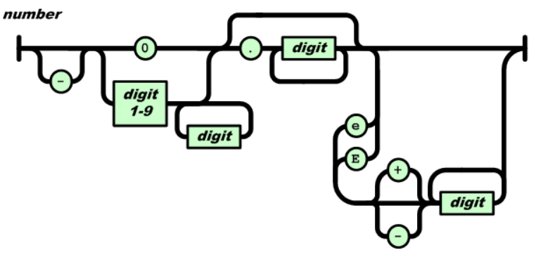
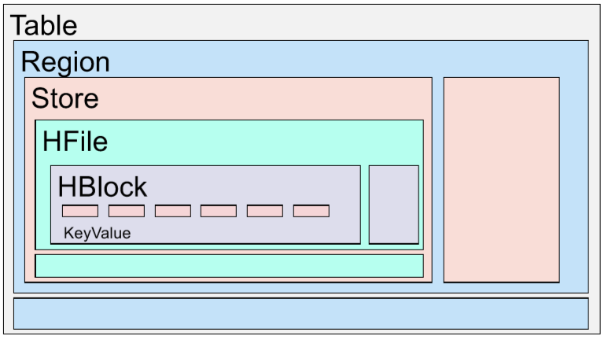

# Big Data Best of questions
## Week 02

CAP theorem 

- No **C**onsistency: Just return your store/garbage.
- No **A**vailabilty: It takes forever.
- No **P**artition-tolerance: There is no partitioning.	

Symmetry vs. Heterogeneity? 

- both if possible
- Symmetry means every system has the same responsibilities; there is no clear master.
- Heterogeneity allows that servers have different CPUs/hardware, but still in the same ballpark (e.g. 8GB vs 16 GB, not 4 KB). They have more/less load according to their exact hardware.
- Nodes are symmetric in responsibilities but heterogeneous in loads.	

R+W>N 

- **N** amount of replicates in the system. 
- **R** amount of replicates that we need to get to successfully **read**. If **R** is big, **W** is low and the clients can **write** faster. 
- **W** amount of replicates that we need to get to successfully **write**. If **W** is big, **R** is low and clients can **read** faster.
- If both are high, we have a higher consistency, durability, but slower (increased latency) and worse availability.
- R+W>N: There has to be at least one node that has seen a write up-date that gets read. 	

Why are virtual nodes introduced?

	
- Easier to distribute/balance across nodes.
- Counter randomness a bit.		
		

Why do we need a vector-clock instead of timestamps? 

	
- Ensure consistency.
	- Imagine a scenario with N=2, R=2, W=1. Client1 adds "hi" to node 1 and afterwards Client2 adds "bye" to node 2,
		without a synchronisation between the two nodes in between. If a client now reads it gets the two versions and can not tell if "bye" deleted "hi" first or just the scenario as above.
	- With vector-clocks this can be resolved, because the reading client sees, that they have not updated with each other; they are forks of each other.		
		

Why is a Merkle hash-tree used to check if two nodes have the same items? 

	
- The Merkle tree allows for easier checks of the whole ring. The leafs are one key-range each and each parent is the hash of its children;
	like that a node only has to check the hashes it got from the sibling up to the top, instead of hashing other leafs.
- Like this it is easier to check if both copies of a key-range have the same items.		
		

## Week 03

Importance of Throughput, Capacity and Latency? 

- Depends on the application, but Capacity can be much higher compared to Throughput, which can be bigger than Latency.
	

	

What is the advantage of having small blocks? 

It is easier to parallelize over different nodes/hard drives, but the search time to find them is larger, which impacts latency.

What is the advantage of having big blocks? 

We hardly have to search this block, but we have to send the whole block over the network, even if we only need a small part, we also have a higher chance if the block fails,
also we use more storage if we can not fill the whole block with data.	

What is the difference between object storage and file file storage? 

|**Object storage**|**File storage**
|-:|-:|
|Billions of TB files|Millions of PB files	|
|bad latency, better throughput	|better latency, worse throughput	|
|allows random access	|only allows scanning	|
|often only key-value, (get/put)	|file system exists	|
|offered as services by Amazon (or other) use with other people	|create&use cluster yourself	|

HDFS architecture: 

What should a NameNode do? 

- File namespace +Access control (how the file system looks like)
- File to block mapping
- Block to location (node)	

How does a data block look like? 

- Each data block consists of the data itself and it's metadata (checksums, generation stamp) in two separate files.	

What is the benefit of a higher replication factor? 

- Higher replication is higher fault tolerance and increases read bandwidth.

## Week 04

What are the possible JSON values? 

- Object, array, number, string, boolean, null 

How would you model an empty element in XML? 

- With <*element* />

What data-structure does a JSON manifest? 

- A dict, without duplicate keys. 

What does a number in JSON correspond to in Python? 

- JSON is programming language independent and the standard only defines conformance, not how to interpret the text e.g. if an object is a list or an array.

What are possible JSON value types? 

- A JSON value can be one of:
	- object
	- array 
	- number 
	- string
	- literal name token

What are the tokens in JSON?

- JSON text is formed out of strings, numbers and 9 tokens.

- 6 Structural tokens:
	- [
	- {
	- ]
	- }
	- :
	- ,

- 3 literal name tokens:
	- true
	- false
	- null

How are numbers represented in JSON? 

What data-structure does a XML manifest? 

- A tree.

How is the root level different to any other level in XML? 

- There must be exactly one leaf in this level, not more, not less.

Does order matter in XML? 

- The order of elements matters.
- The order of attributes does not matter. 

Which characters are legal for XML element names? 

- Alphanumeric, special characters, "-","\_" and "." 

- Of those legal characters, which can be at the start? 

- Small and capital letter, "\_".

Which characters must be escaped in text? 

- <, &

	

What is the purpose of "<\!\[CDATA\[\"? 

- You do not have to escape <,&, only the end tag of CDATA. The content in CDATA will be seen as text, no elements in there.

Is the tag "aTag" the same as "atag" in XML? 

- No, Tags are case-sensitive.

What is the "forbidden sequence" of XML-comments? 

- "--" can only be used to close with -->, else you have escape. 

What is an XML declaration there for and how does a sample look like? 

- The XML declaration sets grounds for reading the XML file to follow.
- <?xml version="1.0" encoding="UTF-8" standalone="no" ?>

How can the default namespace be changed? 

- To change the namespace in the scope of the tag, you have to change the attribute *xmlns*.

How can the default namespace be changed? 

- To change the namespace in the scope of the tag, you have to change the attribute *xmlns*.

	

How are non-default namespaces defined? 

- They are defined like normal attributes registered in the xmlns namespace, they can be used in the same tag as they are created.

Is there a difference between elements and attributes regarding namespaces? 

- Yes, attributes do not have the default namespace function, you can only explicitly define namespaces on them. 

## Week 05

What are CRUD operations? 

- **C**reate
- **R**ead
- **U**pdate (write)
- **D**elete 

Why can there be a total order in HBase? 

- HBase supports ACID with locks, as there is exactly one RegionServer per row, this is (easier) possible.

	

What is a region in HBase? 

- A list of rows determined by a range of their RowID.

What is stored on the same physical machine in HBase? 

- A *store*, a column family of the same region.

What is the hierarchy of entities in HBase? 

- Table &rightarrow; Region &rightarrow; Store &rightarrow; HFile &rightarrow; HBlock &rightarrow; KeyValue

Where are stores saved? 

- They are saved in one or multiple HFiles in HDFS.

What are cells in HBase? 

- Cells are timestamped (milliseconds passed since midnight, January 1, 1970 UTC) values of row x column, due to versioning, there may be many.

Why do regions exist in HBase? 

- Regions are essentially contiguous ranges of rows stored together and are the partitions in HBase, each region has a region server.

What is in a key of a HFile? 

- (RowID,columnID,version/timestamp)

What is in a value of a HFile? 

- One HFile consists of many 64kB big *HBlocks* of data to make it easier to search things.

Why does HBase not do redundancy? 

- It is built on top of HDFS, which already does redundancy.

Why does HBase not do redundancy? 

- It is built on top of HDFS, which already does redundancy.

How is data stored on persistent storage? 

- In Log-structured merge-trees, which double in size for every level, and every level holds at most one node.

What is the accuracy property of Bloom filters? 

- Bloom filter give no false negatives, but can give false positives.

## Week 06

What is the difference between well-formed vs valid documents? 

- Valid documents must adhere some schema and the language, well-formed documents must only be well-formed in the language. Every valid document must be well-formed.

Is a document without a schema valid? 

- By definition a valid document must have a schema, if it does not have a schema it is neither valid nor invalid.

JSON vs. XML 

What is the default behaviour if a specified schema element does not exist in the document? 

- If the element does not exist, the document is not valid.

Read through [06_readings](../week 06/06_readings.md) for the schemas.