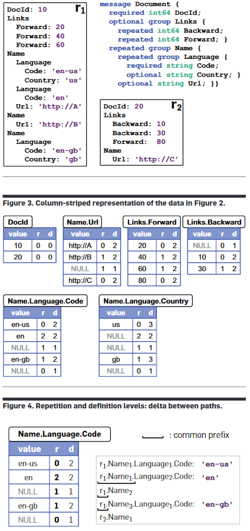

# Big Data Best of questions
## Week 02

CAP theorem 

- No **C**onsistency: Just return your store/garbage.
- No **A**vailabilty: It takes forever.
- No **P**artition-tolerance: There is no partitioning.	

Symmetry vs. Heterogeneity? 

- both if possible
- Symmetry means every system has the same responsibilities; there is no clear master.
- Heterogeneity allows that servers have different CPUs/hardware, but still in the same ballpark (e.g. 8GB vs 16 GB, not 4 KB). They have more/less load according to their exact hardware.
- Nodes are symmetric in responsibilities but heterogeneous in loads.	

R+W>N 

- **N** amount of replicates in the system. 
- **R** amount of replicates that we need to get to successfully **read**. If **R** is big, **W** is low and the clients can **write** faster. 
- **W** amount of replicates that we need to get to successfully **write**. If **W** is big, **R** is low and clients can **read** faster.
- If both are high, we have a higher consistency, durability, but slower (increased latency) and worse availability.
- R+W>N: There has to be at least one node that has seen a write up-date that gets read. 	

Why are virtual nodes introduced?

	
- Easier to distribute/balance across nodes.
- Counter randomness a bit.		
		

Why do we need a vector-clock instead of timestamps? 

	
- Ensure consistency.
	- Imagine a scenario with N=2, R=2, W=1. Client1 adds "hi" to node 1 and afterwards Client2 adds "bye" to node 2,
		without a synchronisation between the two nodes in between. If a client now reads it gets the two versions and can not tell if "bye" deleted "hi" first or just the scenario as above.
	- With vector-clocks this can be resolved, because the reading client sees, that they have not updated with each other; they are forks of each other.		
		

Why is a Merkle hash-tree used to check if two nodes have the same items? 

	
- The Merkle tree allows for easier checks of the whole ring. The leafs are one key-range each and each parent is the hash of its children;
	like that a node only has to check the hashes it got from the sibling up to the top, instead of hashing other leafs.
- Like this it is easier to check if both copies of a key-range have the same items.		
		

## Week 03

Importance of Throughput, Capacity and Latency? 

- Depends on the application, but Capacity can be much higher compared to Throughput, which can be bigger than Latency.
	

	

What is the advantage of having small blocks? 

- It is easier to parallelize over different nodes/hard drives, but the search time to find them is larger, which impacts latency.

What is the advantage of having big blocks? 

- We hardly have to search this block, but we have to send the whole block over the network, even if we only need a small part, we also have a higher chance if the block fails,
	also we use more storage if we can not fill the whole block with data.	

What is the difference between object storage and file file storage? 

|**Object storage**|**File storage**
|-:|-:|
|Billions of TB files|Millions of PB files	|
|bad latency, better throughput	|better latency, worse throughput	|
|allows random access	|only allows scanning	|
|often only key-value, (get/put)	|file system exists	|
|offered as services by Amazon (or other) use with other people	|create&use cluster yourself	|

HDFS architecture: 

What should a NameNode do? 

- File namespace +Access control (how the file system looks like)
- File to block mapping
- Block to location (node)	

How does a data block look like? 

- Each data block consists of the data itself and it's metadata (checksums, generation stamp) in two separate files.	

What is the benefit of a higher replication factor? 

- Higher replication is higher fault tolerance and increases read bandwidth.

## Week 04

What are the possible JSON values? 

- Object, array, number, string, boolean, null 

How would you model an empty element in XML? 

- With <*element* />

What data-structure does a JSON manifest? 

- A dict, without duplicate keys. 

What does a number in JSON correspond to in Python? 

- JSON is programming language independent and the standard only defines conformance, not how to interpret the text e.g. if an object is a list or an array.

What are possible JSON value types? 

- A JSON value can be one of:
	- object
	- array 
	- number 
	- string
	- literal name token

What are the tokens in JSON?

- JSON text is formed out of strings, numbers and 9 tokens.

- 6 Structural tokens:
	- [
	- {
	- ]
	- }
	- :
	- ,

- 3 literal name tokens:
	- true
	- false
	- null

How are numbers represented in JSON? 

What data-structure does a XML manifest? 

- A tree.

How is the root level different to any other level in XML? 

- There must be exactly one leaf in this level, not more, not less.

Does order matter in XML? 

- The order of elements matters.
- The order of attributes does not matter. 

Which characters are legal for XML element names? 

- Alphanumeric, special characters, "-","\_" and "." 

Of those legal characters, which can be at the start? 

- Small and capital letter, "\_".

Which characters must be escaped in text? 

- <, &

	

What is the purpose of "<\!\[CDATA\[\"? 

- You do not have to escape <,&, only the end tag of CDATA. The content in CDATA will be seen as text, no elements in there.

Is the tag "aTag" the same as "atag" in XML? 

- No, Tags are case-sensitive.

What is the "forbidden sequence" of XML-comments? 

- "--" can only be used to close with -->, else you have escape. 

What is a XML declaration there for and how does a sample look like? 

- The XML declaration sets grounds for reading the XML file to follow.
- \<\?xml version="1.0" encoding="UTF-8" standalone="no" \?\>

How can the default namespace be changed? 

- To change the namespace in the scope of the tag, you have to change the attribute *xmlns*.

How can the default namespace be changed? 

- To change the namespace in the scope of the tag, you have to change the attribute *xmlns*.

	

How are non-default namespaces defined? 

- They are defined like normal attributes registered in the xmlns namespace, they can be used in the same tag as they are created.

Is there a difference between elements and attributes regarding namespaces? 

- Yes, attributes do not have the default namespace function, you can only explicitly define namespaces on them. 

## Week 05

What are CRUD operations? 

- **C**reate
- **R**ead
- **U**pdate (write)
- **D**elete 

Why can there be a total order in HBase? 

- HBase supports ACID with locks, as there is exactly one RegionServer per row, this is (easier) possible.

	

What is a region in HBase? 

- A list of rows determined by a range of their RowID.

What is stored on the same physical machine in HBase? 

- A *store*, a column family of the same region.

What is the hierarchy of entities in HBase? 

- Table &rightarrow; Region &rightarrow; Store &rightarrow; HFile &rightarrow; HBlock &rightarrow; KeyValue

Where are stores saved? 

- They are saved in one or multiple HFiles in HDFS.

What are cells in HBase? 

- Cells are timestamped (milliseconds passed since midnight, January 1, 1970 UTC) values of row x column, due to versioning, there may be many.

Why do regions exist in HBase? 

- Regions are essentially contiguous ranges of rows stored together and are the partitions in HBase, each region has a region server.

What is in a key of a HFile? 

- (RowID,columnID,version/timestamp)

What is in a value of a HFile? 

- One HFile consists of many 64kB big *HBlocks* of data to make it easier to search things.

Why does HBase not do redundancy? 

- It is built on top of HDFS, which already does redundancy.

Why does HBase not do redundancy? 

- It is built on top of HDFS, which already does redundancy.

How is data stored on persistent storage? 

- In Log-structured merge-trees, which double in size for every level, and every level holds at most one node.

What is the accuracy property of Bloom filters? 

- Bloom filter give no false negatives, but can give false positives.

## Week 06

What is the difference between well-formed vs valid documents? 

- Valid documents must adhere some schema and the language, well-formed documents must only be well-formed in the language. Every valid document must be well-formed.

Is a document without a schema valid? 

- By definition a valid document must have a schema, if it does not have a schema it is neither valid nor invalid.

JSON vs. XML 

What is the default behaviour if a specified schema element does not exist in the document? 

- If the element does not exist, the document is not valid.

Read through [06_readings](../week 06/06_readings.md) for the schemas.

In Dremel, what does *r* and *d* stand for? 

- *r* is for repetition, which tells how many hops are shared between the current and previous path.
- *d* is for definition, which tells how big the whole path is.
- **Required fields are not counted.** 

Can you give a Dremel example? 

## Week 07

What is the difference between HBlock and a HDFS block? 

- They are different levels, HBlocks are on the file level, HDFS blocks are on the (quasi-)physical level.
- HBlock is extended, so every key-value is in the same HBlock. A HDFS block has a fixed size and key-values will be cut if it has to be done. 	

What happens in the Map phase? 

- Filter the necessary fields from the input Key-values into a new, intermediate Key-value relationship. (E.g. From lines of text to words and their counts)	

Why is there a Combine phase? 

- Combine is an optional phase, that can be added to make sure less data has to be transmitted.	

What happens in the Combine phase? 

- The mapper can already combine(reduce) the results for the first time, before sending each key-value pair to the reducers in the shuffle phase.	

What are the properties the Combine function must have? 

- The function key-value input/output are be the same as in the reduce phase and the function is associative and commutative.	

 

What happens in the Shuffle phase? 

- The intermediate Key-values get sorted and then partitioned nicely for the next phase. (E.g. all counts of the same word go to the same reducer)	

	

What happens in the Reduce phase? 

- The function that we want to use will be applied to the sorted intermediate values. (E.g. add up all counts of the same word.) 	

What are the big O complexities of MapReduce? 

- The first immediate results only depend on one shard (Map). O(1)
- The second immediate results depend on many other first immediate results (Shuffle). O(n^2)
- The final results only depend on one of the second immediate results (Reduce). O(1) 	

	

Can we start the next phase after the first results of the previous phase are available? 

- Hardly, as the next phase depends on the previous phase.

	

What does the master do in the MapReduce framework? 

- Keep track of the status of each of the *M* map and *R* reduce tasks (idle, in-progress, completed)
- The ID of the worker for the non-idle tasks.
- Store the location and size of the intermediate values (partially) completed by the map tasks.
- Transmit those locations to in-progress reduce tasks.
- Ping each worker to see if he has not failed.
- Balance jobs and re-assign failed(including jobs which have completed, but the data  was not already fetched by the following consumer) jobs.

## Week 08

What is a slot? 

- A slot are some computing resources (memory+processor) that can execute jobs.	

What is the drawback of too few slots? 

- Too few slots (*under-subscribed*) can be clogged by resource-light jobs, that do not need the whole share of resource.

What is the drawback of too many slots? 

- Too many slots (*oversubscribed*) that makes the jobs to be pre-empted, because the resource is needed by another job. 

What are the problems of MapReduce? 

- MapReduce only scales to thousands, not dozens of thousands.
- JobTracker is a single point of failure.
- JobTracker has to do two things: schedule and monitoring
- The amount of memory is static.
- Some resources are idle, because another phase gets executed.	

What does YARN make different? 

- It adds another layer of master(*ResourceManager*)-client(*NodeManager*). A *NodeManager** may open a MapReduce JobTracker *container* and asks for more *containers*/slots.	

What is the workflow of a Spark job? 

- The user builds the pipeline of transformations, but requesting the action then triggers the execution of that pipeline.	

What is an *ApplicationMaster*? 

- The head *container* of an application (e.g. MapReduce), that also wants new storage for it's application. It also does the monitoring and fault tolerance of the application.

What does a *ResourceManager* do? 

- They are the admin entry gate.
- It checks the heartbeats of the *NodeManager*s.
- It checks the heartbeats of the *ApplicationMaster*s.
- They balance and assign new resources demanded by the client or *ApplicationMaster*s.
- Authentication of *ApplicationMaster*s and users, to make sure the resources wasted by somebody else to ensure fairness.
- Is still not failure resistant.	

How can slots be scheduled? 

- FIFO
- Capacity scheduling, where there are sub-groups that are weighted differently(in proportion to their capacity) and are merged to a bigger queue.
- Fair Scheduling, like capacity scheduling, but there is neither user nor weights.	

What is queue elasticity? 

- If one user-group does not use it's whole capacity, it can be shared with another user-group.	

What is the difference between instantaneous fair share vs. steady fair share? 

- Instantaneous fair share does exclude empty queues and shares the remaining resources according to steady fair share.	

What is pre-emption? 

- Cut off a job, after it has taken too long.	

How does dominant resource fairness work? 

- If there are multiple resources (e.g. memory and cores) categorize each sub-group by it's dominant resource.
		- The dominant resource is the one with the higher percentage need of the whole cluster.
- The final sharing then has to be normalized by the sum of dominant resources.
- **Another way** to look at it is that with that we entangle CPU percentage with memory percentage and use this resource then.	

What is the lifecycle of an RDD? 

- **Creation:** Taken from the filesystem (local, S3, HDFS..)
- **Transformation:** Transform RDD to another RDD (e.g. MapReduce on a RDD)
- **Action:** Save the final output (not an RDD), this triggers all the computations before, because the previous computation were lazy.

## Week 09

In Spark, can one task of stage 2 run, when another of stage 1 is still running? 

- No.

What are DataFrames? 

- DataFrames are fixed length, stored columnarly, "0NF-tables", created from a SQL query and then transformed into RDDs. 

What are the benefits of DataFrames? 

- Uses a lot less memory, can be created with SQL.

What is the difference in creation of a schema between a RDBMS and Spark? 

- RDBMS have to define a schema and import data for the table, Spark reads directly from the data.

What is the bottleneck MapReduce solves? 

- Disk I/O, with more disks.

What is latency? 

- The time until the first result.

What is throughput? 

- The amount of operations/mega bytes per second.

What is response time? 

- It is the time until the results; the last operation= latency+transfer\**operations*

How is speed-up defined? 

- old latency/new latency

What is the formula of Amdahl's law? 

- Speed-up=1/(1-p+p/s), where *p* is the parallelisable part and *s* is the amount of parallel workers.

What is Gustafson's law? 

- Speed-up=1-p+sp, , where *p* is the parallelisable part and *s* is the amount of parallel workers.

## Week 10

What is UTF-8? 

- It is an encoding of the Unicode character catalogue.

What is tail latency? 

- Stragglers/ that take significantly more time than other jobs.

What can be done against stragglers? 

- Execute every job twice, but about costs twice as much.
- Start with the second/back-up job, once the first one takes too long.

What are the 3 basic integrities of RDBMs?  

- Atomic integrity (all entries are atomic values, not dicts or the like)
- Tabular/Relational integrity (all relations between tables are valid)
- Domain integrity (all entries in the same column have the same type)

What is the atomicity of MongoDB? 

- Atomicity on one document, like the row-atomicity of HBase.

What is the document landscape that works best with document stores? 

- Many small files of megabytes.

Document stores vs. RDBMs 

- Good at projection and selection
- Passable at aggregation
- Bad at joins

- Also in document stores, you validate a document after you have populated.

What is the default document format in MongoDB? 

- BSON, "JSON in binary", with a bit more data types.

What are *write concerns* in MongoDB? 

- The difference between a synchronous (wait for ACK of all secondary nodes) and asynchronous (don't wait) action.

In MongoDB, if an object has an array, where the condition only holds on certain elements, will the condition hold for the whole object? 

- By default, if one element of an array matches, this condition counts as fulfilled for the whole object.

How do indices work? 

- Looking up the index in a table points to all the matching elements.

What is the best data structure for indices? 

- A B+-tree, where the inner nodes are criteria and the leafs are the elements.

Why does it not make sense to have a index on *year* and one on *year* , *month*? 

- *year* , *month* already contains an index on *year*, as it is a prefix.

Can we index the entries of an array in MongoDB? 

- We can index every entry of one (not two+) array, but not the array as a whole. The index does not store the position of the element in the array.

## Week 11

What makes a good query language? 

- Declarative: What? (and not how) also enables data independence
- Functional: The language expressions act like mathematical functions that operate on an instance of a model.
- Set-based: Act on one or a set of instances and output a set of instances.

What are the properties of JSONiq sequences? 

- The sequence is ordered and flat, without a hierarchy.

What is the difference between a sequence of (1) and the array [1] in JSONiq? 

- The sequence is equal to 1, while the array encodes a level of hierarchy.

Can I add an integer and a string? 

- No, JSONiq is typed, the only "semi-typed" object is the empty set.

What does FLOWR stand for? 

- For
- Let
- Order by
- Where
- Return
- (Group by)

What is a difference when grouping between FLOWR and SQL? 

- In SQL, after grouping, the rows are not available any more, only the groups, whereas with FLOWR, each row of the group still is available.

What are the three execution modes in RUMBLE? 

- Dataframe-based execution, which uses the dataframe interface (fastest, most constrained)
- RDD-based execution, on the back of Sparks RDDs (medium, medium)
- local exucution, like a single-core Java implementation (slowest, most expressive)

## Week 12

What does a graph solve? 

- Complex relations for traversals of relationships

What are the ingredients for a stored graph? 

- n nodes
- m (directed) edges
- p properties which are attached to nodes or edges (object attributes, except for information which is stored in edges)
- l labels, which corresponds to the type of an edge or node, multiple labels are possible

What do edges represent in the graph model? 

- Foreign keys

What is the architecture of Neo4j? 

- Core servers (master)- read replicas (client)

What makes a read replica in Neo4j? 

- Clients can read from it.
- Data replication

When is synchronous data replication done? 

- When a user updates a table he will be blocked until the data has been replicated on a majority of read replicas.

When is asynchronous data replication done? 

- After the synchronous data replication, the data gets spread to the other minority of the read replicas.

Why is sharding hard in graphs? 

- Most queries traverse a highly-connected graph and due to the polymorphy of edges, the system does not know how best to shard.

What is index-free adjacency? 

- Edges are saved on each node and not in a global index.

How are relationships(edges) stored? 

- Two double linked list of edges at each end, because edges are not ordered in the data model and we need to discover all of them.
- source-previous, source-next
- target-previous, target-next

Which guarantees does Neo4j provide? 

- Atomicity
- Recoverability
- Availability
- Scalability (since graphs are by design local)

How is atomicity achieved in Neo4j? 

- Data only gets written if is wholly done, either by memory flush or written in the write ahead log.

How is recoverability achieved in Neo4j? 

- After a crash, read the write ahead log and chatter with peers.

How is availability achieved in Neo4j? 

- Master-slave architecture with core nodes and read replicas.

## Week 13

What is slow interactive? 

- Takes minutes, but still somewhat interactive.

Why does OLTP not normalise? 

- It is read intensive and has little updates, so the run time save from not doing joins is bigger than the loss from more writes.

OLTP vs OLAP 

What are the properties of a data warehouse? 

- object oriented (single subject)
- integrated (of other databases, like a CRM, ERP)
- time variant (explicit in the reporting from 5-10 years)
- non-volatile (no updates, maybe increment every week)

What does ETL stand for? 

- Extract (from other databases)
- Transform (data cleaning)
- Load (sort, partition, indexing, integrity constraints)

What is *slicing*? 

- Selecting/extract all the data with a given feature value.

What is *dicing*? 

- Often 2 dicers, aggregating over the remaining values given a slice and the feature to aggregate on.

What is ROLAP? 

- query cubes similar to a RDBMS
- transparent with relational parents

What is MOLAP? 

- proprietary memory format, cube is less transparent

What is the difference between a raw data cube(ROLAP) and a formal data cube(MOLAP)? 

- the formal data cube is already aggregated and therefore may not have any duplicates.

What are measures in a fact table? 

- different values (dimensions) given the keys, e.g. cost,profit

What are satellite tables? 

- Extra information on the central table.

What is the star schema? 

- Each dimension in the main table has a satellite table.

What is the snowflake schema? 

- Satellite tables can have satellite tables.

What is *group by cube*? 

- Take the whole cube, the power set of the dimensions and group by each element of that powerset.

What is a cross tabulation? 

- The output of group by cube, where each cell is given and aggregates on all dimensions and sets of dimensions.

What is the syntax to store cubes? 

- XBRL

Why can we forget about the drawbacks of XBRL? 

- It is not highly efficient, but the database, where the file is fed into is more efficient.

	