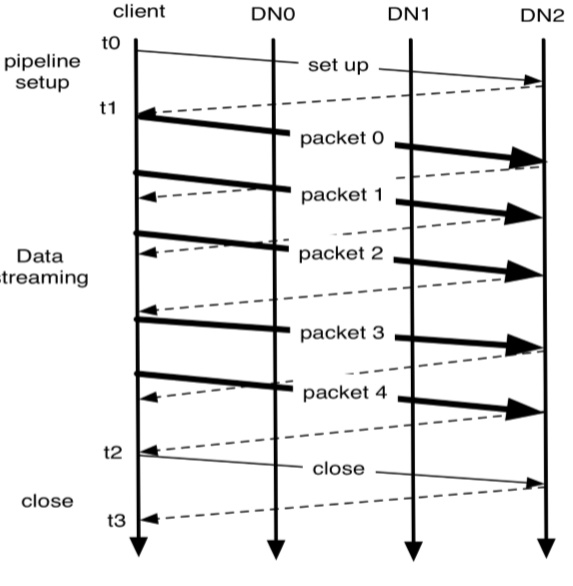

# Big Data Week 03

## Questions
### Throughput, Capacity, Latency, Block Size

Importance of Throughput, Capacity and Latency? 

- Depends on the application, but Capacity can be much higher compared to Throughput, which can be bigger than Latency.
	

	

What is the advantage of having small blocks? 

- It is easier to parallelize over different nodes/hard drives, but the search time to find them is larger, which impacts latency.

What is the advantage of having big blocks? 

- We hardly have to search this block, but we have to send the whole block over the network, even if we only need a small part, we also have a higher chance if the block fails,
	also we use more storage if we can not fill the whole block with data.	

Why are HDFS blocks larger than normal (NTFS) blocks? 

- The reason is to minimize the cost of seeks. Once the block is found the streaming time is rather short and random-access is not the most important property.	

	
### HDFS use case architecture

What is the difference between object storage and file file storage? 

|**Object storage**|**File storage**
|-:|-:|
|Billions of TB files|Millions of PB files	|
|bad latency, better throughput	|better latency, worse throughput	|
|allows random access	|only allows scanning	|
|often only key-value, (get/put)	|file system exists	|
|offered as services by Amazon (or other) use with other people	|create&use cluster yourself	|

HDFS architecture: 

What should a NameNode do? 

- File namespace +Access control (how the file system looks like)
- File to block mapping
- Block to location (node)	

What does a secondary NameNode do? 

- The secondary NameNode aggregates the log and makes checkpoints. It needs the same amount of RAM as the first one and making new checkpoints is a big job, that gets made about daily.	

	

What does the DataNode do? 

- It stores blocks of data.	

What does the NameNode and DataNode talk with each other? 

- DataNode always initiates the connection to NameNode and sends heartbeats
	- NameNode answers with block operations
- every 6 hours there is a block report, to check if all blocks are stored/no block got corrupted	

How does HDFS relate to the local computer on the DataNode? 

- HDFS blocks are stored as files on the physical computer (DataNode).	

With what does the bandwidth of HDFS scale? 

- The bandwidth scales with the number of nodes. (After a big enough amount of nodes/jobs.)

### Read/Write

How does a data block look like? 

- Each data block consists of the data itself and it's metadata (checksums, generation stamp) in two separate files.	

How does a client get data from HDFS? 

- The client asks the NameNode about a file.
	- The NameNode responds with the BlockIDs, sorted by distance to fetch.
- The client then asks one DataNode for each BlockID for the data.

	

How does a client store data in the HDFS? 

For each block:
	- The client asks the NameNode for DataNodes to store it's data.
	- The client gets the DataNodes.
	- The write-pipeline gets built by the first DataNode.
	- The client sends data through the DataNode pipeline.
	- The client gets ACKnowledgement from the DataNode, once all have it written.
	- The client tells the DataNode that the write is finished.
	- The DataNodes tell the NameNode that they have received the block (while doing the heartbeat).
Next block

	

How does the pipeline work? 

	

How is the distance computed? 

- The distance is the amount of network hops you have to make to the replica.
	- 0, if both on same node.
	- 2, different nodes on same rack
	- 4, different racks, same datacenter	

What does the write-ahead log do? 

- Journal acts as a write-ahead commit log for changes to the file system and the journal has to be flushed and synched before the transaction is reported to the client.	

### Balancing & Replication

Where are the replicas optimally placed? 

- Same rack as the client.
- Two on one different rack, but different DataNodes.

Where is the filesystem saved? 

- In RAM of the NameNode.
- Can be reconfigured from the block reports, but takes time (30 minutes).
- The Standby/Backup/vice NameNode saves a log on it's own hard-drive and keeps one copy in RAM for hot swap of primary NameNodes.
- The secondary NameNode stores a checkpoint in persistent storage.

What is the balancing metric? 

- Percentage of used storage on one node compared to percentage of used storage on whole system.

	

What is the benefit of a higher replication factor? 

- Higher replication is higher fault tolerance and increases read bandwidth.

	

The chance that a node randomly dies is relatively small. Why is a snapshot still a good idea? 

- The chance of HDDs dying is significantly higher if the power gets cut (for maintenance) and other maintenance work can increase this probability temporarily.

How are snapshots created? 

- First, create a new checkpoint at a new location, DataNodes changes make a new hard-linked version of the storage directory and change the file system to copy-on-write.

