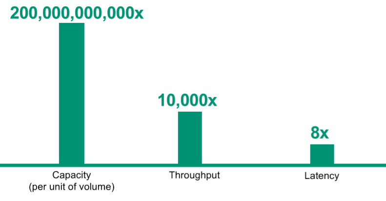
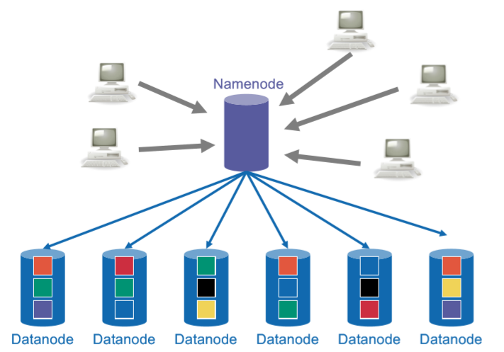
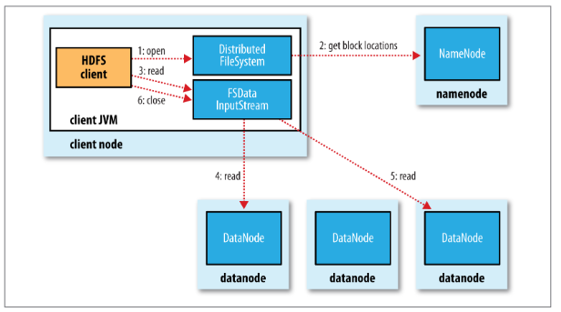
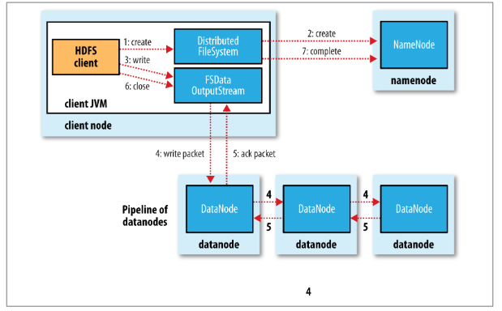

# Big Data Week 03

## Questions
### Throughput, Capacity, Latency, Block Size
- Importance of Throughput, Capacity and Latency?
	- Depends on the application, but Capacity can be much higher compared to Throughput, which can be bigger than Latency.
	

- What is the advantage of having small blocks?
	- It is easier to parallelize over different nodes/hard drives, but the search time to find them is larger, which impacts latency.
- What is the advantage of having big blocks?
	- We hardly have to search this block, but we have to send the whole block over the network, even if we only need a small part, we also have a higher chance if the block fails,
	also we use more storage if we can not fill the whole block with data.
- Why are HDFS blocks larger than normal (NTFS) blocks?
	- The reason is to minimize the cost of seeks. Once the block is found the streaming time is rather short and random-access is not the most important property.
	
### HDFS usecase architecture
- What is the difference between object storage and file file storage?
	|**Object storage**|**File storage**
	|-:|-:|
	|Billions of TB files|Millions of PB files	|
	|bad latency, better throughput	|better latency, worse throughput	|
	|allows random access	|only allows scanning	|
	|often only key-value, (get/put)	|file system exists	|
	|offered as services by Amazon (or other) use with other people	|create&use cluster yourself	|
- HDFS architecture:

- Why can HDFS be centralized?
	- Because it can, as there are a lot fewer customers (only one company).
- What should a NameNode do?
	- File namespace +Access control (how the file system looks like)
	- File to block mapping
	- Block to location (node)
- What does a secondary NameNode do?
	- The secondary NameNode aggregates the log and makes checkpoints. It needs the same amount of RAM as the first one and making new checkpoints is a big job, that gets made about daily.
- What does the DataNode do?
	- It stores blocks of data.
- What does the NameNode and DataNode talk with each other?
	- DataNode always initiates connection to namenode and sends heartbeats
		- NameNode answers with block operations
	- every 6 hours there is a block report, to check if all blocks are stored/no block got corrupted
- How does HDFS relate to the local computer on the DataNode?
	- HDFS blocks are stored as files on the physical computer (DataNode).
- With what does the bandwidth of HDFS scale?
	- The bandwidth scales with the number of nodes. (After a big enough amount of nodes/jobs.)
### Read/Write
- How does a client get data from HDFS?
	- The client asks the NameNode about a file.
		- The NameNode responds with the BlockIDs, sorted by distance to fetch.
	- The client then asks one DataNode for each BlockID for the data.
	
	
- How does a client store data in the HDFS?
	For each block:
		- The client asks the NameNode for DataNodes to store it's data.
		- The client gets the DataNodes.
		- The write-pipeline gets built by the frist DataNode.
		- The client sends data through the DataNode pipeline.
		- The client gets ACKnowledgement from the DataNode, once all have it written.
		- The client tells the DataNode that the write is finished.
		- The DataNodes tell the NameNode that they have received the block (while doing the heartbeat).
	Next block
	
	

- How is the distance computed?
	- The distance is the amount of network hops you have to make to the replica.
		- 0, if both on same node.
		- 2, different nodes on same rack
		- 4, different racks, same datacenter
### Balancing & Replication
- Where are the replicas optimally placed?
	- Same rack as the client.
	- Two on one different rack, but different DataNodes.
- Where is the filesystem saved?
	- In RAM of the NameNode.
	- Can be reconfigured from the block reports, but takes time (30 minutes).
	- The Standby/Backup/vice NameNode saves a log on it's own harddrive and keeps one copy in RAM for hot swap of primary NameNodes.
	- The secondary NameNode stores a checkpoint in persistent storage.
- What is the balancing metric?
	- Percentage of used storage on one node compared to percentage of used storage on whole system.
- What is the benefit of a higher replication factor?
	- Higher replication is higher fault toelareance and increases read bandwidth.
- The chance that a node randomly dies is relatively small. Why is a snapshot still a good idea?
	- The chance of HDDs dying is significantly higher if the power gets cut (for maintenance) and other maintenance work can increase this probability temporatily.