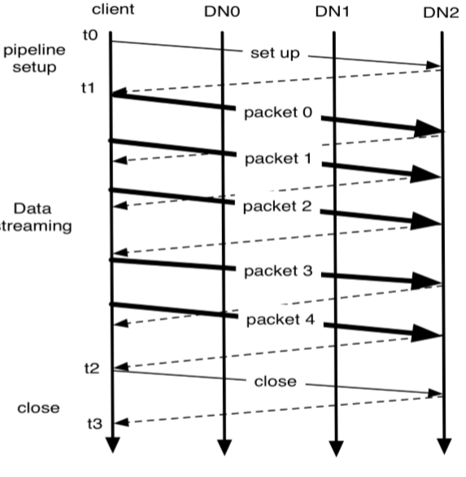

# Big Data Week 03

## Use case
Store very large data sets reliably and to stream those data sets at high bandwidth to user applications.

Partitioning of data and computation across many (thousands) of hosts.

HDFS stores file system metadata (NameNode) and application data (DataNode) separately. 

No RAID in same node,  reliability only by using different nodes.

## [The Hadoop Distributed File System](https://doi.org/10.1109/MSST.2010.5496972)

### NameNodes
Directories are saved as inodes, which record permissions, modificationa and acces times, namespace and disk space quotas.

The NameNodes also keep track of the mapping of data to DataNodes.

Namespace is saved in RAM, make checkpoints from time to time, also a log(=*journal*) which can be stored at other servers.

### DataNodes
Each datablock consists of the data itself and it's metadata (checksums, generation stamp) in two seperate files.

*StorageID*= persistent ID of the DataNode.

DataNode sends block reports to NameNode consisting of the block ID and its generation stamp, to keep the NameNode up-to-date.

Also send heartbeats with current load, so NameNode may answer with instructions to replicate block to other nodes, remove local block replicas, re-register/shut-down or send immediate block report.

### HDFS client
HDFS supports read/write/delete file, create/delete dir.

NameNode decides DataNodes to write to and client sets up writing pipeline to them for each block. 

### Image and Journal
Journal acts as a write-ahead commit log for changes to the file system and the journal has to be flushed and synched before the transaction is reported to the client.

To save I/O latency transactions can be batched and then flushed together.

### Secondary NameNode
Periodically combines the existing checkpoint and journal to create a new checkpoint and empty journal, that is then sent to persistent storage.

Good practice is to create a daily checkpoint.
### CheckpointNode
Does the same thing as the secondary NameNode, but uploads the new image to the primary NameNode instead of persisten storage.

### BackupNode /StandbyNode
BackupNode can be seen as a read-only NameNode, that stores system metadata, but no block locations. Kicks in, when the NameNode fails with hardly any downtime.

### Snapshots
Snapshots are used for high problem time, like updates. Only one snapshot at a time can exist.

First, create a new checkpoint at a new location, DataNodes changes make a new hardlinked version of the storage directory and change the file system to copy-on-write.

### File read and write
HDFS implements a single-writer (creator has priority, but others may come), multiple-reader model.

HDFS does not guaratnee that data is visible until the file is closed by writer. *hflush* ensures that the pipeline is run through and the change is visible.

When reading, the client fetches the list of blocks and their DataNode from the NameNode and then queries the closest DataNode.

### Block placement
The default HDFS block placement policy provides a tradeoff between minimizing the write cost, and maximizing data reliability, availability and aggregate read bandwidth.   HDFS places the first replica on the node where the writer is located, the second and the third replicas on two different nodes in one different rack.

All subsequent replicas are strayed out randomly within certain bounds.

### Replication management
The block report gives information whether a block is over- or under-replicated. Then, the NameNode tells to delete a replicate on a server that already has a second copy or else the server with the most traffic. If it should be added, the priority is by how much it is under-replicated.

One data block should not be more than two times in a rack.

### Balancer
The balancing metric is the percentage of used storage on one node compared to percentage of used storage on whole system.

The balancer then can swap data blocks, but has to keep the block on at least two different racks.

### Block Scanner
Blocks are periodically scanned to see if the checksums still hold and is used for the block report.

### Decomissioning
The NameNode looks after decomissioning, delegates all new writes from the to-be-decomissioned DataNode, only permits reads and initializes new replicas of this DataNode.

When all blocks are newly copied again, the DataNode is decomissioned.

