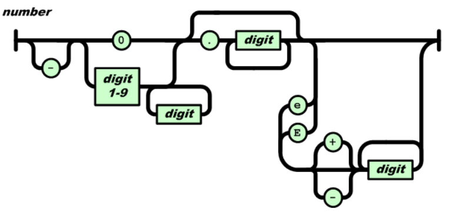

# Big Data Week 04

## [JSON Standard](https://www.ecma-international.org/publications/files/ECMA-ST/ECMA-404.pdf)
### JSON General
JSON is a text syntax that facilitates structured data interchange.

JSON  also  depends  on  Unicode  in  the  hex numbers used in the \u escapement notation.

JSON is agnostic about the representation of numbers, they are saved as human readable.

JSON does not support cyclic graphs, JSON is not optimized for binary data.

JSON is programming language independent. Standard only defnines confromance, not how to interpret the text, e.g. if an object is a list or an array.

A JSON file consists of JSON text, which forms exactly one JSON value, which can be comprised of objects, arrays, numbers or strings. 
### JSON Text
JSON text is formed out of strings, numbers and 9 tokens.
6 Structural tokens:
- [
- {
- ]
- }
- :
- ,

3 literal name tokens:
- true
- false
- null

Whitespaces (tab, line feed, carryreturn, space) are allowed before and after any token for prettyfying, but not within any token, except strings.
### JSON Values
A JSON value can be one of:
- object
- array 
- number 
- string
- true
- false 
- null
### Objects
An object is represented as (*name*/*value*)\* pairs surrounded by a pair of curly bracket tokens. Where a *name* is a string, followed by a single colon, to separate it from the *value*.
A single comma separates *value* from the next name.

JSON names can be any string, doubled and the ordering is not guaranteed.
### Arrays
Place *values* inside of square brackets and separate one *value* from the other by a comma.
The ordering is again open.
### Numbers



Only one exponent allowed, only one leading 0 allowed, then dot or e.
Non- numeric numbers like NaN or Infinity are not allowed.
### String
Unicode character wrapped in quotation marks. Escaping with \, new line and friends are also with \n etc..

Any UTF-8 (in the basic multilingual plane) character can be represented by \u*(4-digit\*number)*, one can send non-UTF-8 chars (which have more than 4 digits) represented as a twelve-char sequence encoding in the UTF-16 surrogate pair, but if it is seen as two UTF-8 or one UTF-16 is the job of the processor, not the language.
## [XML Fundamentals](https://docstore.mik.ua/orelly/xml/xmlnut/ch02_01.htm)

## [XML Namespaces](https://docstore.mik.ua/orelly/xml/xmlnut/ch04_01.htm)
### Purpose
- Distinguish between elements and attributes from different vocabularies with the same name.
- Group related names, so that the software can more easily read it.
### Syntax
Namespace assign names to URIs (*namespace names*). URIs often have special characters, they can not be in the XML like that and need a shorter prefix.
A name then is specified with:

*(prefix)*:*(name/local part)*=*qualified name*

Prefix and local part are made out of XML name characters except colons, the prefix xml is reserved to their dev team.

The prefix is not inherited from the parent and each child that needs this prefix has to append it again, but the scope where the prefix is known is inherited.
Prefixes can be redifined, where the "newest" is the strongest, but that is bad style.
```
<f:table xmlns:f="https://www.w3schools.com/furniture">
<f:name>African Coffee Table</f:name>
<f:width>80</f:width>
<f:length>120</f:length>
</f:table>
```
Prefixes are only variables, only the value behind (the URI) is important. The URIs should be explained, but can lead to 404, the standard does not define anything. The URIs are case-sensitive and do not check the page, only the name.
### Default Namespace

```
<table xmlns="https://www.w3schools.com/furniture">
<name>African Coffee Table</name>
<width>80</width>
<length>120</length>
</table> 
```
The default namespace does not apply to elements with prefixes. Also default namespaces only work on elements, not on attributes.
