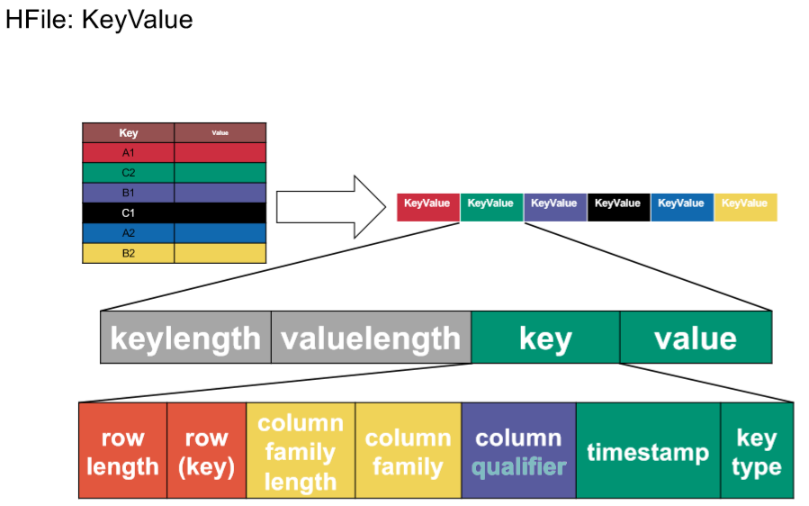

# Big Data Week 05 questions
## General

What are the disadvantages of RDBMS? 

- They are hard to set up and have high maintenance cost if you scale them up(out).

What is wide column storage? 

- It stores some columns together after another and not one whole row after another.

What are the basic operations of HBase? 

- Get(*RowID*)
- Put(*Row-Values*)
- Scan(*Range*)
- Delete(*RowID*)

Why can there be a total order in HBase? 

- HBase supports ACID with locks, as there is exactly one RegionServer per row, this is (easier) possible.

What are CRUD operations? 

- **C**reate
- **R**ead
- **U**pdate (write)
- **D**elete 

## Terminology

What is a region in HBase? 

- A list of rows determined by a range of their RowID.

What is stored on the same physical machine in HBase? 

- A *store*, a column family of the same region.

What is the hierarchy of entities in HBase? 

- Table &rightarrow; Region &rightarrow; Store &rightarrow; HFile &rightarrow; HBlock &rightarrow; KeyValue

What are cells in HBase? 

- Cells are timestamped (milliseconds passed since midnight, January 1, 1970 UTC) values of row x column, due to versioning, there may be many.

What is the default amount of cells for a value? 

- Default is 3.

Why do regions exist in HBase? 

- Regions are essentially contiguous ranges of rows stored together and are the partitions in HBase, each region has a region server.

## HFiles

Where are stores saved? 

- They are saved in one or multiple HFiles in HDFS.

How is a HFile structured? 

- It is a sorted key-value list.

What is in a key of a HFile? 

- (RowID,columnID,version/timestamp)

What is in a value of a HFile? 

- One HFile consists of many 64kB big *HBlocks* of data to make it easier to search things.

Why is there no length for column qualifier? 

- All others are defined or fixed.

What is the purpose of the key type in a HFile? 

- It tells whether a row is (to be) deleted in lazy deletion.

	

When is data physically deleted? 

- Data gets deleted when the two leafs merge. If there was a delete operation in one of the nodes, in the merged one, the data is omitted and the previous leafs deleted.

## Implementation

What is meant by HBase replication? 

- The replication of the whole deployment to another datacenter.

Why does HBase not do redundancy? 

- It is built on top of HDFS, which already does redundancy.

What does the HMaster do? 

- It is similar to the NameNode, it keeps track of the tables and the column families. Additionally it balances the ranges to the RegionServers.

Why is there a Write-Ahead Log (HLog)? 

- MemStore flushes all of it's memory content into a HFile, this means the memory is sorted. Sorting takes time, as a quick measure to safe the operation it is added to the Write-Ahead Log.

	

How is data stored on persistent storage? 

- In Log-structured merge-trees, which double in size for every level, and every level holds at most one node.

What guarantees does HBase give? 

- Access to row data is atomic and includes any number of columns being read or written to. There is no further guarantee or transactional feature that spans multiple rows or across tables. 

## [Bloom filter](https://de.wikipedia.org/wiki/Bloomfilter)

Where are Bloom filters used? 

- In the HFile index, to check whether a key is in the file.

What is the accuracy property of Bloom filters? 

- Bloom filter give no false negatives, but can give false positives.

