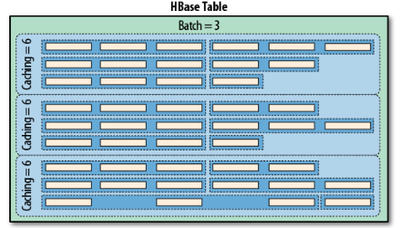

# Big Data Week 05
## HBase - The Definitive Guide
### Column-oriented databases
Column-oriented databases save their data grouped by columns.

The reason to store values on a per-column basis is that often not all of the values are needed. Column-orientation offers reduced I/O and better compression.
### RDBMS Problems
- RDBMS scales vertically, e.g. scale up, not out.
	- or they get slow
	- or they get inconsistent
- Joins are expensive.
### Consistency
Every operation must lead from one consistent state to the next consistent state.
- **Strict** &rightarrow; operations are atomic and appear instantaneously
- **Sequential** &rightarrow; operations are in the same order as they were applied
- **Causal** &rightarrow; all changes that are causally related are observed in the same order.
- **Eventual** &rightarrow; after some time, all replicas will be consistent.
- **Weak** &rightarrow; no guarantee
### Properties of databases
- **Data Model** &rightarrow; Key-Value/FS/other
- **Storage Model** &rightarrow; In-memory or persistent
- **Consistency Model** &rightarrow; Strict/Eventual/Weaker
- **Physical Model** &rightarrow; Distributed/single machine
- **Performance** &rightarrow; More write heavy or read heavy
- **Secondary Indexes** &rightarrow; Are secondary indexes needed?
- **Failure Handling** &rightarrow; What do if a machine crashes?
- **Compression** &rightarrow; How much storage do you  need? How much can you afford?
- **Load Balancing** &rightarrow; Already inside?
- **Atomicity** &rightarrow; Needed, how much can you relax it?
- **Locking** &rightarrow; What is the best locking model? How do you solve deadlocks?

### De-Normalization & Sharding 
Depending on the access patterns it might make sense to not go for the highest Normal Form, which makes easier writes and updates, but go for a lower one with more replication, but faster read-times, as less joins have to be performed.

Separation of records into horizontal partitions often distributes them among many files and computers. Re-sharding and adding new data during that process can be tricky.
### Table architecture
Rows are always lexicographically sorted by their Row ID. HBase has support for secondary indexes. Cells are timestamped (milliseconds passed since midnight, January 1, 1970 UTC) values of row x column, due to versioning, there may be many, default is 3.

Column Families need to be defined at table creation time, should be limited to some low dozens, their name has to be composed of printable characters and they can hold an unbound amount of columns, which are all stored in the same HFile.

(Table, RowKey, Family, Column, Timestamp) &rightarrow; Value

**Regions** are essentially contiguous ranges of rows stored together. Each region (and by extension also each row) is served by exactly one region server, and each of these servers can serve many regions at any time. The regions help with fast recovery and load balancing.

### Storing
Every *HFile* consists of a block index and many (data) blocks where the default block size is 64 KB. The index is in memory and used to easier search a block.

Usually *HFiles* are written to HDFS, which takes care of replication.

Updated data is first saved in the commit/write-ahead log and then stored in-memory at the *memstore*. If the *memstore* is full enough, it is flushed as an *HFile* to disk and the commit log can be reset. To delete, you have to write the *delete marker* instead. The commit log is never read at run-time, only after a crash.

To read data you have to read the *memstore* in-memory and the HFiles on disk.

To keep the amount of files lower, the HFiles are a [LSM tree](https://en.wikipedia.org/wiki/Log-structured_merge-tree).

The master node is only used to keep track of the regions, table and column family design and track the availability of the region-servers.

Region-servers hold all the data and communicate directly with the client, much like HDFS.
### Atomicity
Access to row data is atomic and includes any number of columns being read or written to. There is no further guarantee or transactional feature that spans multiple rows or across tables. The atomic access is also a contributing factor to this architecture being **strictly consistent**.

HBase implements atomic read-modify-write sequences on data stored under a **single** row key, but not multiple.

### API General 
The API is written in Java. The primary client interface is the *HTable* class. Updates are batched together as much as possible. To make an action you have to get a *configuration* (e.g. with the server address), with that create a *HTable* object and then first create rows on your own machine with *put* until you put that row to the *HTable*. The column name (*qualifier*) can be *NULL*.

Each action gets it's timestamp once it goes to the server, but due to locking the action might be applied later.
### CRUD operations
- create
	*Put* needs a unique row key to create a row (*Put(byte[] row)*). After the row is created, one can add data with (*Put add(byte[] family, byte[] qualifier, byte[] value)*). One can give an additional timestamp or else the region-server will do so.
- read
	```
	List<KeyValue> get(byte[] family, byte[] qualifier)
	Map<byte[], List<KeyValue>> getFamilyMap()
	```
	Will return *KeyValue*s in the first line and in the second show it's content. Much like *put*, you first *create* the row you want to get and then add the others column families/columns on you own machine until you get it from *HTable*.

	*boolean has/exists(byte[] family, byte[] qualifier, byte[] value)* Will only check if there is a value.
- update
	Also a *Put*
- delete
	One can set a timestamp on a *delete* operation, to make sure only the value with this timestamp gets deleted. If the timestamp does not exist, nothing happens. If you use *deleteColumns* it deletes only one column, but all versions of that (*column* x *row*).

For delete and put there also exist atomic versions, get does not need a lock to begin with.
### List and batches
Each *Put*/*Delete* is a Remote Procedure Call(RPC), which are bottlenecked by their round-trip time. To balance that, they can be batched together for each region-server in a client-side write buffer. The buffer is not written to HBase yet, so it can't be read.

A problem in the middle with creating the array blocks addition the following *puts*, but during sending, this is not the case, as each *put* is handled as an own instance.

*Gets* can also be put into lists, but unlike *puts*, they stop in the middle if there is a problem anywhere.

To read a range of rows, there is the *scan* command. One can also add a timestamp range and select only certain columns. Applying the scanner to the *HTable* returns a *ResultsScanner* which can be iterated. Scanners need to be closed. The amount of retrieved samples at a time can be regulated, but more samples need more memory and less RPCS. The timeout time is on the region-server side. *Scan batches* batch the columns, not the rows. RPCs = (Rows \* Cols per Row) / Min(Cols per Row, Batch Size) / Scanner Caching +1 for open +1 for closing +1 to check.


Don't mix *delete* and *put* operations in the same badge, as the batch can be reordered! Batches act like lists of *puts*.

## [Bigtable: A Distributed Storage System for Structured Data](https://static.googleusercontent.com/media/research.google.com/de//archive/bigtable-osdi06.pdf)
A Bigtable is a sparse, distributed, persistent multidimensional sorted map.

Every read or write of data under a single row key is atomic.
### Column families
The amount of distinct column families should be small and those families should rarely change, as they are the regions that get cut. Access control and both disk and memory accounting are performed at the column-family level.

A column is accessed via *family*:*qualifier*. Column family names must be printable and should be short, as they get save **a lot**, but *qualifiers* may be arbitrary strings, but also preferably short.
### Cells
Each cell in a Bigtable can contain multiple versions of the same data, which are indexed by timestamp in decreasing order, such that most recent is on top.
### Chubby
Bigtable uses Chubby for a variety of tasks:
- to ensure that there is at most one active master at any time
- to store the bootstrap location of Bigtable data
- to discover tablet servers and finalise tablet server deaths
- to store Bigtable schema information(the column family information for each table)
- and to store access control lists 
### Start-up
The client library caches region locations to make faster connections without going over the master.

The master executes the following steps at startup:
1. The master grabs a unique master lock in Chubby, which prevents concurrent master instantiations. 
1. The master scans the servers directory in Chubby to find the live servers. 
1. The master communicates with every live tablet server to discover what tablets are already assigned to each server. (heartbeat) 
1. The master scans the METADATA table to learn the set of tablets. Whenever this scan encounters a tablet that is not already assigned, the master adds the tablet to the set of unassigned tablets, which makes the tablet eligible for tablet assignment. 

### Storing
During the lifetime of the program the data gets stored in memory (*memtable*). If the memory is full it has to be flushed to disk as a immutable *HFile*. Multiple HFiles can be merged according to the Log-Structured Merge Tree and if all HFiles get compacted deleted values get deleted from the HFiles.

### Performance
Write is faster than read, because we only need to append instead of searching.

Sequential reads are faster because of  spatial locality.