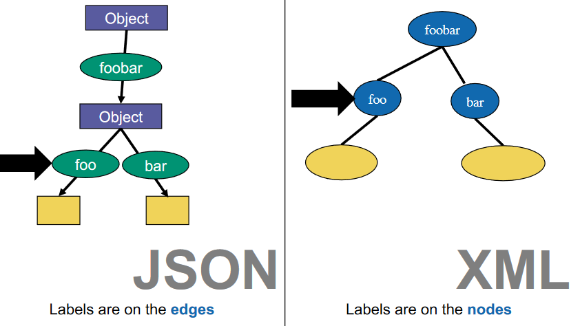

# Big Data Week 06
## General
- What is the objective of the lecture?
	- Going from physical representation (XML/JSON) to a logical representation (data model).
- What do XML/JSON encode?
	- They encode trees.
- What is the difference between XML and JSON?
	-XML knows it's name
	

- What are the 4 XML (most important) information items?
	- Document &rightarrow; children, version
	- Element &rightarrow; local name, children, attributes, parent
	- Attribute &rightarrow; local name, normalized value, owner element
	- Character(Text) &rightarrow; characters, owner element
- What are the 4 type system fundamentals?
	- Distinction between atomic types and structured types
	- More or less the same categories of atomic types
	- Lists and maps(dict) as structured types
	- Sequence type cardinalities
- In database normal forms, when is the distinction between atomic types and structured types used?
	- 1.NF only uses atomic types, non-normal allows structured types.
- What are the atomic datatypes?
	- String
	- Numbers (often arbitrary precision in logical)
	- Boolean
	- Dates and Times
	- Time Intervals (Since months are not well defined)
	- Binaries
	- Null
- What are the 3 cardinality types?
	- One (required)
	- \* zero or more (repeated)
	- ? zero or one (optional)
	- + one or more
- What is the difference between well-formed vs valid documents?
	- Valid documents must adhere some schema and the language, well-formed documents must only be well-formed in the language. Every valid document must be well-formed.
- What is the high level structure of a dataset?
	- A dataset is a list of maps.
- What is an example of a homogeneous dataset?
	- A database/CSV.
- What is the difference between homogeneous and heterogeneous datasets?
	- Heterogeneous may have missing values. 
- What are the categories of formats?
	- Text vs. binary
	- Nested vs. flat
	- Schema optional vs. required
- What should we do if nothing about attributes is said?
	- If nothing is written about attributes, they are allowed.
- What is the default behaviour if an element does not exist?
	- If the element does not exist, the document is not valid.