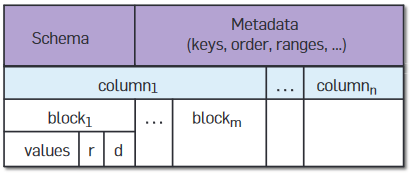

# Big Data Week 06

## [XML Schemas](https://docstore.mik.ua/orelly/xml/xmlnut/ch16_01.htm)
Schemas can describe complex restrictions on elements and attributes. Multiple schemas can be combined to validate documents that use multiple XML vocabularies.

An XML document described by a schema is called an *instance document*. If a document satisfies all the constraints specified by the schema, it is considered to be *schema-valid*.
A *instance document* can be one of:
	- An *xsi:schemaLocation* attribute on an element, that contains a list of namespaces used within that element.
	- An *xsi:noNamespaceSchemaLocation* attribute contains a URL for elements outside of namespaces.
### Schemas vs. DTDs
DTDs include:
	- Element nesting
	- Element occurrence constraints (cardinality)
	- Permitted attributes
	- Attribute types and default values
	
W3C includes:
	- **Simple and complex data types**
	- **Type derivation and inheritance**
	- Element occurrence constraints (cardinality)
	- Namespace-aware element and attribute declarations
	
Schemas validate against the combination of the namespace URI and the local name rather than the prefixed name.

The schemaprocessor also can get hints via the namespace, e.g. the *schemaLocation* must be in the default namespace to be processed correctly.

### Basic Building Blocks
Schema that only allows strings:
```
<?xml version="1.0"?>
<xs:schema xmlns:xs="http://www.w3.org/2001/XMLSchema">
 <xs:element name="fullName" type="xs:string"/>
 </xs:schema>
 ``` 
 
 Then specify the schema with:
 ```
 <?xml version="1.0"?>
<fullName xmlns:xsi="http://www.w3.org/2001/XMLSchema">
 <xsi:noNamespaceSchemaLocation="address-schema.xsd">Jannik
 </fullName>
 ``` 

xs:schema must be the root of a schema. Direct children of this root are called *global elements* and can be root elements of documents. Same names are finally disallowed, attributes are not elements though.

Another top level child is *xs:annotation*, which hold copyright and authorship for other humans. *xs:appinfo* can hold *comments* for apps to read.

The xs defined types are:
	- anyURI
	- base64Binary
	- boolean
	- byte
	- dateTime
	- duration
	- ID,IDREF,IDREFS,ENTITY, ENTITIES, NOTATION, NMTOKEN, NMTOKENS
	- integer
	- language
	- Name 
	- normalizedString (without newline tab and others)
	- string 
	- token (same as normalizedString)
Attributes must always be of those basic types and an element that is declared to have a simple type can't have any attributes.

To have declaration one must make a *xs:element* with *xs:complexType* that has *xs:simpleContent* which has a *xs:extension* that then has a *xs:attribute*
*xs:complexType* name="fullName"
	- *xs:simpleContent*
		- *xs:extension* base="xs:string"
			- *xs:attribute* name="language" type="xs:language"

Attribute definitions can also be pasted with the *xs:attributeGroup ref=Name*  macro if they are in the top level of the schema, the same hold for *xs:complexType*, where the name of the *complexType* is the type of the element.
Groups of mixed contents (lists/maps) can also be referenced with *xs:Group* in the schema.

*xs:sequence* starts a dict declaration in the schema, where each element must be in the document, in the exact same order.
*<xs:choice>* gives the choice of exactly one of the encapsulated elements.
*<xs:all>* says that all of the encapsulated elements must be in the element in the doc, but the order does not matter.

*xs:any(Attribute)* element tell the schema processor that zero or more elements may occur at this location, it is used for setting attributes like namespace or *processContents="skip"* if the content should not be validated. 

One can set the cardinality in the schema with the *maxOccurs* and *minOccurs* attributes of elements. For n one can use *unbounded*.

Instead of explicitly saying that an element should be empty one can say that another *complexType* should live there and then not declare that *complexType*. *Null* is therefore the only empty *complexType*.
*xs:complexContent* must be used instead of *xs:simpleContent* to use complex data-types further down. Simple content is a basic data-type that may be restricted by *facets*.

### Importing schema pieces from other files
*<xs:include schemaLocation="path"/>* lets you now reference other files in the schema as if they were at the bottom of this file.

*<xs:redifine schemaLocation="path">* let's you import names, but extend/restrict it for this schema file, much like Java classes, unless the to-be-redefined class has a *final* attribute.


Using *xs:import*, it is possible to make the global types and elements that are declared by a schema belonging to another namespace accessible from within an arbitrary schema. There are also abstract classes.

### Facets
Possible facets:
	- length (or minLength and maxLength)
	- pattern (of regex)
	- enumeration &rightarrow; allowed values, many different values (e.g. True and False) must be in two following elements 
	- white-space &rightarrow; preserve, replace (with UTF) or collapse (and replace then)
	- maxIncluse and maxExclusive
	- minInclusive and minExclusive
	- totalDigits (before and after the coma, the coma not counted)
	- fractionDigits (after the coma)

Facets are applied by using the *xs:restriction* element in the schema and then e.g. *<xs:maxLength value="50"/>* can be used.

```
 <xs:simpleType name="myInt">

  <xs:restriction base="xs:integer">

      <xs:maxExclusive value="5"/>

  </xs:restriction>

 </xs:simpleType>
 ```

*<xs:union memberTypes="*first_type second_type*"/>* makes it possible to allow two different data-types. The *fixed* attribute for facets works like *final* for elements.

The *mixed* attribute of a element controls whether character data may appear between other elements, such that it may look like a html file.
### Namespaces
To enforce a namespace in a schema, one can use the *targetNamespace* attribute of *xs:schema*. Doing so, one also has to change *xsi:noNamespaceSchemaLocation* to *xsi:schemaLocation* in the element of the document where the URL is the first token separated by a white-space to the schema it should point to. The element in the document then still has to adhere to that namespace.

With *attributeFormDefault ="qualified"* all the attributes mentioned in the schema must be in the element as well, also with their prefix.

### Uniqueness
*xs:unique* element forces an existing key-value/attribute pair to be unique in the selected xpath.
```
<xs:unique name="book">
	<xs:selector xpath="book"/>
	<xs:field xpath="isbn"/>
</xs:unique>
```
*xs:key* works the same, but forces that at least one instance exists for each of the selector elements. 

## [Understanding JSON-Schema](https://json-schema.org/understanding-json-schema/)
### General
The schema itself is written in JSON.

The empty object and "true" always give a valid JSON, "false" always gives a invalid JSON.

The "type" keyword can be used to enforce a type, for multiple possibilities give them in an array.

"enum" gives an array of acceptable values. "const" gives only the only acceptable value.

"$schema" should say that it is a schema and also the schema (draft) version.

"$id" can be used to make sure the schema is unique, gives a name that can be referenced and hints where other files that are referenced should be fetched from.
### Strings
- "minLength"
- "maxLength"
- "pattern" (for regex)
- "format"
	- "data-time" &rightarrow; "2018-11-13T20:20:39+00:00"
	- "time" &rightarrow;"20:20:39+00:00"
	- "date" &rightarrow; "2018-11-13"
	- "email" & "idn-email"
	- "hostname" & "idn-hostname"
	- "ipv4" & "ipv6"
	- "uri" & "uri-reference" & "iri" "iri-reference" & "uri-template"
	- "json-pointer" & "relative-json-pointer"
	- the JavaScript variant of "regex"
### Numeric types
JSON has no standard way to represent complex numbers, so there is no way to test for them in JSON Schema.
**JSON-type &rightarrow; Python**
"integer" &rightarrow; integer
"number" &rightarrow; float
- "multipleOf": positive number
- "minimum" & "exclusiveMinimum" & "maximum" & "exclusiveMaximum"

### Object types
"properties" is used for the elements of the object. By default, leaving some out or adding some extra is okay.

To control against additional elements, "additionalProperties" is a schema that the other properties have to adhere to, this means 
```
"additionalProperties": false
```
will restrict all additional elements. Similarly, there exists "patternProperties", that uses an object where the key is a regex and the value the schema it has to adhere to. 

"required" is an array of required names/keys in the object.

"propertyNames" can also be checked against a schema.

"minProperties" & "maxProperties" give the cardinality of the object.

"dependencies" say that if one element exists, the other also has to exist, not the other way round.
```
  "dependencies": {
    "credit_card": ["billing_address"]
  }
```
Or the other option is to give a schema that the element has to adhere to.

### Array
"items" gives a schema that **all** entries of the array have to adhere to.

"contains" gives a schema that **one** entry of the array has to adhere to.

To address each element of the array independently give an array of schemas. One can leave the last ones away or add more to the end, if all previous have been provided. But one can also use "additionalItems" like in objects.

"minItems", "maxItems", "uniqueItems": boolean, which makes sure that every value is unique, exist.

### Boolean & Null
There is only one way of writing them.
### Generic keywords
Generic keywords can be used to give annotations/comments in schemas. "title", "description", "default", "examples" exist for explaining annotations, "$comment" makes comments.
### Binaries
Not many validators support it.

"contentMediaType" can be used to infer a MIME type of the contents of the string that represent a binary. "contentEncoding" says if 7bit, 8bit, binary, quoted-printable or base64 is used, if nothing is specified it uses the same encoding as the one of the JSON file.

### Schema meta operations
- "allOf": Must be valid against all of the subschemas (can not be used to extend existing schemas)
- "anyOf": Must be valid against any of the subschemas
- "oneOf": Must be valid against **exactly one** of the subschemas
- "not": Must not be valid against the given schema
- "if"/"then"/"else": like in traditional languages, can be wrapped with "anyOf" to make more cases possible.
### Structuring schemas
To define a structure in the schema put it in the "definitions" object.

To reference it use "$ref": "#/definitions/*name*", this is a copy and paste and the URL is called a JSON-pointer, where # is the root of the file, other files can also be referenced. "$ref" can also be used for recursion.

## [Dremel: Interactive Analysis of Web-Scale Datasets](https://dl.acm.org/doi/10.1145/1953122.1953148)

Dremel is a scalable, interactive ad hoc query system for analysis of read-only nested data by using a serving tree, where each node does some computation.

Workers have different capabilities.

Dremel is in situ, what is decently fast thanks to a common storage layer, like GFS. Often used to analyse MapReduce outputs. SQL-like language. Dremel uses a column-striped storage representation.

### Data model
The data model (*Protocol Buffers*) is based on strongly typed nested records, which in the end looks similar to JSON and are cross-language.

Try to store the columns next to each other to improve retrieval efficiency, what is hard if they are (arbitrarily) nested and/or repeated.

Each column is stores as a set of blocks.
### Encoding tree position of same type
The encoding is a delta encoding between two paths, the path from the previous one and the encoding from the new path. The two parameters are *r* for repetition, which tells how many hops are shared and *d* for definition, which tells how big the whole path is. Required fields are not counted. A *d* smaller than the max depth denotes a *NULL*. The encoding preserves the record structure losslessly. *r* gets omitted if *d*=0.

We differentiate between the repeated and non-repeated fields in terms of how we keep track of the repetition levels.
1. For repeated (e.g., Links.Forward), the repetition level denotes the level of its parent field.

2. For non-repeated (e.g., Name.Language.Code), the repetition level denotes the level of the "recently repeated" element.
 


To recreate a file from storage a FSM is used, depending on the queried fields a different FSM gets used.
### Query language
Dremel's language is based on SQL. Each SQL statement takes nested tables and their schemas as input and produces one nested table and its output schema.
### Query execution
During execution not used leafs are pruned away.

Queries are executed using serving trees, which enable parallelizing query scheduling and aggregation and also provide fault tolerance and balancing.

E.g. the root sends the query to the region servers, that then only give the results from their region. On the way up, the results get merged/aggregated. For *joins* on small tables, the table gets sent with the request. Sometimes, more than one pass is needed and the same query goes down and up multiple times.

Intermediary nodes also keep track of the response times of their children and if need be balance the load. To speed-up drastically, we might be happy with responding already after only 98% of answers have arrived.

### Columnar vs row storage
For Dremel a local experiment was 3x faster with columnar storage compared to row storage (for 1-10 fields). Retrieval time about grows linearly with the number of fields. Record assembly is expensive, doubling the exec time.

For a simple query aggregation query on one field Dremel is about 10 as effective as MapReduce. Deeper serving trees are faster (with same amount of leafs), because there is less load to aggregate the incoming results. 

The execution time decreases linearly in the amount of leaf servers.