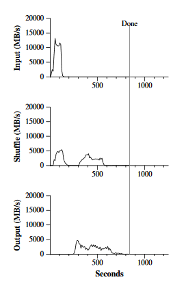

# Big Data Week 07 readings

## HBase - The Definitive Guide - MapReduce Integration
MapReduce processes terabytes of data in a scalable way, as it scales linearly with the added systems to it.

The first step is splitting the data which then can get processed parallelly by different cores.
### Classes
(Table-)*InputFormat* splits the data in splits and defines *key* and *value* objects.

(Table-)*Mapper* maps the *key* and *value* pairs given from the *InputFormat* and possibly emits another type.

(Table-)*Reducer* gets the output of Mapper, after it has been shuffled and sorted.

(Table-)*OutputFormat* persists data in various locations. There is only one *OutputFormat* for many *Reducer*s

### Physical storage implementation
HBase does not do replication; it relies on Hadoop (HDFS) to do that.

Each HDFS block is assigned to a map task. The mapping gets done by one of the usually three nodes that store the HDFS block. The replication gives some room for load balancing. The replication placement of HDFS is also beneficial for data locality; a RegionServer most often stores the data himself or at least close to him.

The number of table splits is equal to all regions between the start and the stop keys. Every split has a *RecordReader*. The split also contains the server name hosting the region/where the data is.

### MapReduce over HBase
If you have more complicated functions, you can either install them to the machines that use those functions or you supply the whole function/library with the MapReduce job file or a link to the path where to get those functions. The second gives more I/O, but a lot less to install and maintain.

Phases can be skipped if specified, which lowers the amount of I/O and work done.

The classes supplied are only helps, you can implement similar ones by yourself if they limit yourself too much.
 
## [MapReduce](https://dl.acm.org/citation.cfm?id=1251264)

### Programming model
The computation takes a set of input key/value pairs, and produces a  set of output key/value pairs.

The intermediate values are supplied to the reduce machine via an iterator to make sure there is enough memory.

- map: (k1,v1) &rightarrow; list(k2,v2)
- reduce: (k2, list(v2)) &rightarrow; list(v2)
### Implementation
Input gets partitioned into *M* splits, where up to *M* cores can process them in parallel.

Afterwards the intermediate values are split to *R* parts, e.g. default is using hash(key)%*R*, but others can be supplied, and sent to the reducing machines.

The size of the shards can be given by the user.

The master assigns tasks to the workers.

The mapping machines keep the intermediate key/value pairs in memory until they have to be written back to local disk, partitioned into the *R* regions, so that they can be fetched by the reducing machines after they are given the task by the master and also asked the master for the location of those intermediate splits. The reducing machine has to sort the splits again and apply the reduce function per key.

In the end each of the *R* intermediary splits makes an output file.

Each of the files have a final atomic message they can send to signal that it is completed.

The result of MapReduce correspond to *some* sequential execution of all those steps, but we don't know which one.

MapReduce is executed on the same machines that host the data, so the data does not have to be transferred around.

Bigger *M*, *R* make it easier to balance the load and a better checkpoint when a worker fails, but gives more pieces the master has to keep track of and gives more output files and files that have to be transmitted.

A good number for *M* is that the input block is roughly 16-64 MB. A sample configuration is *M*=200'000, *R*=5'000 with 2'000 workers. 
### Master
The master does:
- Keep track of the status of each of the *M* map and *R* reduce tasks (idle, in-progress, completed)
- The ID of the worker for the non-idle tasks.
- Store the location and size of the intermediate values (partially) completed by the map tasks.
- Transmit those locations to in-progress reduce tasks.
- Ping each worker to see if he has not failed.
- Balance jobs and re-assign failed(including jobs which have completed, but the data  was not already fetched by the following consumer) jobs.

Simple counters can be hosted on the master, incremented by completed tasks and sent to the client when the whole MapReduce job completed.

In the initial design, the master is a single point of failure and the client has to start the whole MapReduce action again if he fails.

### Stragglers
Stragglers are machines that take an unusually long time to complete one task. They can happen because of hardware failure, bad scheduling or software bugs.

To deal with them, when MapReduce is close to completion, the master schedules a backup process of the current in-progress tasks and that task is finished if either the original or the backup is completed.

### Refinements
A combiner function is executed on the machine that does the map first. Usually, the combiner function is the same as the reduce function, but the output are intermediate key-values instead of output files. This only works if the function is commutative and associative.

(Positive) Side-effects (like inter split atomicity) have to be implemented by the application writer.

Records can be skipped if the task fails on two different machines and the user is okay with that.

### Performance
Input bandwidth is higher than shuffling and reducing bandwidth, as data locality can be exploited. Mapping goes a lot faster if the intermediary key-value pairs are small and fit into memory.

We can see that the shuffle has two spikes, after each round of the mapping, because the first mapping round did not have enough cores to handle all *M* partitions.
### Benefits of MapReduce
MapReduce is:
- simple and small, because it hides
	- parallelization
	- replication
	- fault tolerance
- having good enough performance thanks to locality.
- easy to maintain as much is automated.
- scaling well with new machines.
- expressive enough for many real-world problems.