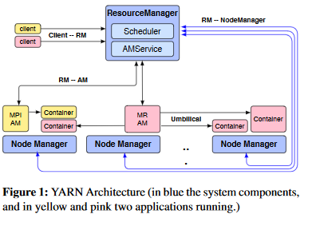

# Big Data Week 08
## [Dominant Resource Fairness](https://cs.stanford.edu/~matei/papers/2011/nsdi_drf.pdf)
### General
DRF can be implemented such that each scheduling decision takes time O(log(users)).

### Max-min fairness and slots
Before DRF, *max-min fairness* was used on a meta-source(*slot*) that was a fixed percentage of a machine.

Allocating them would leave lots of performance idle, that was allocated to get all the percentages out but not used, because the load was not balanced.

Also choosing the amount of slots can have big effects:
- too few slots (*under-subscribed*) can be clogged by resource-light jobs, that do not need the whole share of resource.
- too many slots (*oversubscribed*) that makes the jobs to be pre-empted, because the resource is needed by another job. 
### Allocation properties
Good sharing strategies should tick as many allocation properties as possible:
- Sharing incentive/ balancing
	- each user should benefit from sharing the cluster compared to only use the set of his allocated slot mix
- Strategy-proof/ honesty
	- users should not benefit from lying
- Envy-free/fairness
	- a user should not prefer the allocation of another user
- Pareto efficient/ full power
	- The allocation of one user can not be increased without decreasing another's share.
Nice to have:
- Single resource fairness
	- For a single resource, the solution should resolve to *max-min* fairness.
- Bottleneck fairness
	- If there is one bottleneck resource, the whole strategy should reduce to *max-min* fairness on that resource.
- Population monotonicity
	- When a user leaves, no remaining user should suffer from that.
- Resource monotonicity
	- If more resources are added, a user should not suffer from that.
No allocation policy that satisfies the sharing incentive and Pareto efficiency properties can satisfy resource monotonicity, because if two users need two resources, while they are more dependent on different resources, but still have to split them accordingly, they both gain something from sharing, as each user gets more than half from the bottleneck source. If only one source gets extended heavily and is not a bottleneck any more, the other source gets split fairly, which is worse for the user that was bottlenecked by that resource before.
### Dominant Resource Fairness
DRF computes the share of each resource allocated to that user; the maximum among those resource share per user is called the *dominant share* and the resource that corresponds to that share is called *dominant resource*.

**DRF performs max-min on those dominant shares.**

### Weighted DRF
The definition of a weighted dominant share(*s*) changes to max{u_ij/w_ij}, where *u_ij* is the user *i*s share of the resource *j* and *w_ij* the weight of user *i* on resource *j*.
### Asset Fairness
Each user takes the combined **sum** of all the sub-resources (instead of max), so *c%* for CPU and *m*% for memory and takes *c+m*% now.

This violates the sharing incentive property, if one user needs a lot more (non-crucial) resources it gets a lot less capacity then just take their normal share.
### Competitive Equilibrium from Equal Incomes(CEEI)
Each user initially gets the *Steady Fair Share* and then start trading with each other.

CEEI is not strategy proof. Because if a user is heavily reliant on the bottleneck resource, he can lie about needing more of the less needed resource (and not get less shares of the bottleneck)  and trade it for the bottlenecked resource with one less reliant user.

CEEI is also not population monotone, as with a user leaving, a trading partner with other needs leaves.

### Experiments
The sum of dominant shares may exceed 100%, because they might be on shared resources and they are dynamically given out, so fluxes happen. Since you can not cut a CPU, there might be a discrepancy of one max *needed* compared to something continuous.

DRF outperforms the other strategies in terms of response time, job completion and utilization, especially for long jobs.

## [Resilient Distributed Datasets](https://www.usenix.org/system/files/conference/nsdi12/nsdi12-final138.pdf)
### General
MapReduce only shares computation, not memory, which can help a lot in iterative tasks, as data can be reused. Also MapReduce does not save it's intermediary results somewhere (out of the box) which makes interactive data mining much harder.

Spark's RDDs tries to perform in-memory computations on large clusters in a fault-tolerant manner. Being in-memory means not having to load it to disk and also not converting to something that can go to disk. Further RDDs allow for a data placement and partitioning strategy.

Unlike other operations RDD only allows coarse-grained transformations, which apply to the whole dataset, not just certain entries.

Some programming models that RDDs express well:
- MapReduce
- Iterative MapReduce
- DryandLINQ
- SQL
- Pregel
- Batched System Processing
### Resilient Distributed Datasets (RDDs)
RDDs are read-only, immutable, partitioned collections of records, created(*transformed*) from other RDDs or data in stable storage.

RDDs can be typed, but do not have to. RDDs themselves are a type.

RDDs are a set of deterministic functions(*actions*, bundled into a *lineage*), which are applied to base data.

Users can indicate the *persistence* (where) and the *partitioning* (in which partition) to enable faster computation.

### Recomputing RDDs
If one RDD partition fails (or is in the hand of a straggler), it can be recomputed by finding an *ancestor* of that partition (not the whole dataset) and run through the rest of the *lineage*. All of this while not dependant tasks can still work on their nodes. 

This notion of re-computability also makes it easier to schedule for data locality and easier to debug, as a partition can be recomputed and captured swiftly.

### Storing RDDs
An RDD is represented by:
- a set of *partitions* (atomic pieces of the dataset)
- *dependencies*, which enable to recompute the RDD
- a *function* that describes how to compute the RDD from the *dependencies*
- metadata about *partitioning*
- metadata about *data placement*
All of these properties can be queried by the devs.

RDDs can be persisted with the *persist* keyword, this acts as check-pointing:
- in-memory storage as de-serialized Java objects (fastest)
- in-memory as serialized data (memory efficient)
- on-disk storage (good if RDD only fits on disk, but are too useful to recompute)
### Spark
Spark is written in Scala on top of a JavaVM.

The Scala interpreter is changed only slightly, as classes are served over http and instead of referencing another line of the input (written by the user) reference the value generated by that line.

Devs write a *driver program* that connects to a cluster of *workers*. The driver then also tracks the RDDs lineage.

There is a LRU policy on RDDs, not partitions. If a partition can not be stored on RAM, it throws out a partition from less recently used RDD or go himself to disk, if the other partition is from the same RDD.
### Scheduling
*Narrow* dependencies map one parent partition to at most one child partition, where as *wide* dependencies map one parent partition map to many child partitions. *Narrow* dependencies are preferred, as they are much easier to recompute, easier to track and parents do influence less children on failure.

The scheduler first forms the query into *stages*, which are levels in the DAG. A stage is ended either by root data, already computed data or a *wide* dependency. Each stage should contain as many *narrow* dependencies as possible. After this planning, the output RDD gets computed, if that is not possible, the parent has to be computed (also lazily).

The tasks get mapped to workers based on data locality (bring the task to the data). For *wide* dependencies, the intermediate records get materialized to simplify fault recovery. If tasks take too long or fail, they can be re-run.

### Performance
Spark can be 20-40x faster than Hadoop, which is fast enough to be interactive for a 1TB dataset. Most of the speed-up comes from avoiding I/O and data transformation inside the JavaVM.

The more the data gets reused, the higher is the speed-up, without reuse, the speed-up compared to Hadoop is only very small and comes from having a lighter setup and dealing less with HDFS and not having to do conversion from/to HDFS to use them in the JVM. Spark scales best with more machines compared to Hadoop and can deal with little memory.

Also node recovery is much faster.

## [Apache Hadoop YARN](https://www.cse.ust.hk/~weiwa/teaching/Fall15-COMP6611B/reading_list/YARN.pdf)
### General
YARN works on the *platform* layer, giving resources to the *framework* layer, which does the computations, scheduling and also handles fault-tolerance. There is pretty much no assumption about the *framework* layer. This distinction makes YARN a better scaler, gives programming model flexibility and enables running different versions.

YARN can:
- MapReduce (Pig, Hive, Oozie)
- Tez
- Spark
- Dryad (LINQ)
- Giraph
- Storm
- REEF meta-framework
- Hoya (dynamic HBase on demand)
### Requirements
- Scalability to more than a thousand of nodes.
- Multi-tenancy to allow different users.
- Serviceability to make sure updates and upgrades could be tested, while the old version still could be used by the user.
- Locality awareness to limit data transmit over the network.
- High Cluster Utilization to get the most compute out of the cluster, this means make sure idle nodes return soon and safely (e.g. Mapper nodes when only the Reduce operation is left) and  limiting the allocation phase of the cluster, which also results in lower latencies.
- Reliability/Availability, which means there should not be a single point of failure and no master, that has to do a lot more than other nodes.
- Secure and auditable operation, so that new users can not see all information.
- Support for Programming Model Diversity so that not only MapReduce jobs can be used, which were (ab)used before.
- Flexible Resource Model to make sure the cluster overall has a good mix of latency(many slots wait) and throughput(many slots work).
- Backward compatibility to Hadoop MapReduce as rewriting everything would be too tedious.

### ResourceManager (RM)
There is one RM per cluster with a global view that:
- tracks resource usage
- node liveness
- enforces allocation invariants (fairness, capacity, locality)
- arbitrates contention among tenants

The RM allocates *containers* (individual resources on a particular node) from the (discretized) continuum of resources in response to successful *ResourceRequests* from applications/AMs and checks up on those containers by taking heartbeats from NodeManagers.

AMs codify a *ResourceRequest* to the RM consisting of:
- number of containers
- resources per container
- locality preferences
- priority of requests within the app

ResourceRequests are publicly submitted and persisted by the RM and are validated against credentials before going to the scheduler (in the RM). Once the scheduler has enough resources to run the job, it starts (allocate a container for the AM). 

Even though RMs are a single point of failure, the publicity of the ResourceRequests (which get persisted) make it possible for the RMs to quickly get back. Once the RM is back, it kills everything and starts all AMs new, but most of them are fault-tolerant and can start from checkpoints.

RMs can claim back resources from AMs.

### ApplicationMaster (AM)
The AM is itself a container and can be pretty much any programming model, that exists for each app
- coordinates the logical plan of a job
- dynamically requests resources with heartbeats to the RM
- realizes this plan with the resources it received and tries to optimize this. 
- coordinates the execution around faults and stragglers. The fault information it gets from RM or NM and straggler information it has to find itself.

The process spawned is not bound to the request but to the container lease.

### NodeManager (NM)
The NM is the head of the computation node and has to:
- report the state of his node to the RM
- report the state of the jobs running on the node to the RM
- kill containers if the RM or AM direct it to.
- realize *container launch context* (CLC) to local disk if it has the correct security tokens, the *CLC* encompasses 
	- environment variables
	- dependencies
	- security tokens
	- payloads for the NM services (mostly monitoring)
	- command to create the process

If there are no heartbeats from the NM to the RM, the RM will notify the other AMs that all tasks on this node are killed.

### YARN applications
A YARN app should be able to:
- submit the app by passing a CLC for the AM to the RM.
- send heartbeats from the AM to the RM.
- construct CLCs with the leases from the RM and also release the leases when the task is done.
- clean up the AM after it finished.

### Experiments
YARN processes around 500'000 jobs daily on 350 PB underlying storage. Thanks to YARN task throughput could be increased form 4 million Hadoop tasks to about 10 million YARN tasks, where HDFS NameNodes seem to bottleneck.

YARN works better with longer jobs, as resources can be better freed, because there is no static split between map and reduce slots any more (pre-emption might even make this even more effective), and YARN is more adaptive, because the lighter RM has more capacity to react to more frequent heartbeats with demands. For smaller jobs and smaller clusters, the performance of YARN is compatible with Hadoop.   