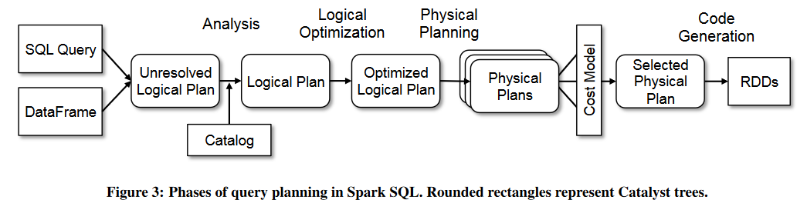

# Big Data Week 09

## [Scalability! But at what COST?](https://www.usenix.org/conference/hotos15/workshop-program/presentation/mcsherry)
COST stands for **C**onfiguration that **O**utperforms a **S**ingle **T**hread and is a measure that shows the size of the machine/cluster needed for a system until it is the same as a simple implementation on a single thread, due to overhead.

This measure is needed, because scalability is often too much emphasized instead of computing time on a smaller (for many enterprises, more reasonable) systems.

Reasons why complicated systems (often) perform worse than a single thread:
- higher level language, in extreme cases a new idea is only faster, because the implementation of that datastructure is more optimized in that language.
- administrative overhead, to check who started and finished already.
- "over-balancing", sometimes spreading the data to other nodes, that then can all keep the information of their partition in memory, takes more time than doing the same job on one node from disk (e.g. each datapoint only has to be used once).
- the big data system only allows one set of programming paradigm (e.g. MapReduce) instead of a more general framework.
- the wrong algorithm/data layout is used, that scales well into big data, but has bad caching and other optimizations for small data.

All systems have a COST of 10 or 100 single-processor implementations for the used PageRank and graph connectivity benchmark on graphs of size between 5 and 15 GB (hardly big data).

**Any system can scale arbitrarily well with a sufficient lack of care in its implementation.**
## [Spark SQL](https://dl.acm.org/doi/pdf/10.1145/2723372.2742797)
### General
Big data apps require a good mix of processing techniques, data sources and storage formats.

Previously there was a rather clear cut between realational database techniques (SQL on tables) and more general procedural interfaces (MapReduce). However, there are many tasks, which need functions from both and have to misuse the programming paradigm to make do. Spark SQL now gives acces to intermix both techniques.

DataFrames can be created directly from Java or Python objects and store data in columnar format. Relational actions are optimized using Catalyst, which is programmed in Scala and can be extended/tuned to use semi-structured such as JSON and HBlocks.

Spark SQL is used on a 8000 node cluster with over 100 PB of data and competitive against SQL-only systems on Hadoop.

Goals for Spark SQL:
- Support relational processing within Spark programs (RDDs) and on external data sources.
- Provide high performance for those actions.
- Open platform to support new data sources.
- Enable extensions with advance analytics algorithms (graphs, ML)

Spark SQL runs on top of Spark and exposes interfaces for JDBC/OBDC or the DataFrame API.
### DataFrames
DataFrames are a distributed collection of rows with the same schema, which is similar to a table, unlike to RDDs, they keep track of their schema to enable optimized SQL queries.

DataFrames can be constructed from (external) tables or RDDs within the system. They are lazily evaluated, like RDDs, but code is eagerly validated, for that Spark SQL can automatically infer the schema of objects using reflection by using the typed objects of the language or sampling from the DataFrame.

Spark SQL uses a nested data model and supports all major SQL data types (bool, int, double, decimal, string, date, timestamp, struct, array, map, union)

Operations on DataFrames are performed using a domain-specific language, like Pandas and all normal SQL actions (select, where, groupby, aggregate, join) are supported, which can be mapped to an abstract syntax tree and optimized by Catalyst, unlike non-Spark SQL, which is just opaque to Catalyst.

Spark SQL can cache DataFrames in memory as native objects, not as JVM objects, by using the *cache* keyword.

User-defined functions (UDF) are needed to provide basic support for JSON data or machine learning algorithms and can be *registered* and afterwards used inline of a SQL query, without separate packaging/registration of a new language/system.

### Catalyst
Catalyst is an extensible optimizer based on functional programming constructs in Scala (no optimizer-specific language), it's extensible, because it makes it possible to add new optimizations and also open it up for external developers, to add data source/type specific rules.

The optimizations can be both rule-based and cost-based.

Catalyst manipulates abstract syntax trees of SQL queries using rules, which finds sub-trees by pattern matching and then replaces them with better sub-trees. It repeats this pattern matching until there is no change. After the optimizations, the tree can be tested again.

Spark begins the analysis with a relation to be computed either from an AST retuned by a SQL parser or from a DataFrame.
1. Type the columns and give each column a clearly identifiable name. (analysis)
1. Restructure that AST with predifined logical rules. (logical optimization)
1. The logical plan from the previous phase then gets mapped to one or more physical plans, where depending on the size of the underlying DataFrames, the plan with the cheapest joins get chosen.(physical planning)
1. The final phase is compiling the selected physical plan to Java bytecode(Code Generation). To do that, type-checked quasiquotes are used, which get parsed by the Scala compiler (similar to *eval*)

Users can add new data sources(e.g. RDBMS tables, sv files, Avro, Parquet) which need to have a schema and optionally an estimated size in bytes. When creating one can say from which node to read, to minimize network I/O.

User-defined types can be composed of built-in types Catalyst types, like in XML. This new type is only seen from within Spark SQL, from the outside (also for compression), these are just "close" columns.

### Advanced analytics features
Spark SQL includes a schema inference algorithm for JSON and other semistructured data, where users can register a JSON object and query it using the path of fields, the inferred types are the most specific types that fit.

Spark SQL can be included in a longer pipeline, where the input and output columns have to be defined and the stages an identifiable name, also (sparse) vectors were implemented in Spark SQL.

### Evaluation
Spark SQL is faster than Shark because the code is generated and optimized in Catalyst, which reduces CPU overhead, but especially for joins, pure RDBMS may outperform Catalyst.

Spark SQL is faster than Python, because JVM is faster than Python. For pipelines Spark SQL avoids using two frameworks and there is no need to store the results in persistable storage and is also simpler.
