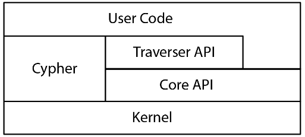

# Big Data Week 12 questions
## General

What are the five basic data shapes? 

- Tables, Trees, Text, Graphs, Cubes

What are the NoSQL data shapes? 

- Table Entity- Relationship model
- Columns
- Triples
- Document stores

## Mathematical graphs

What does a graph solve? 

- Complex relations for traversals of relationships

What are the ingredients for a mathematical graph? 

- n nodes
- m (directed) edges

What do nodes have in common? 

- nothing, except that they are entities

How is a adjacency list built up? 

- The node in one row and an array of the ends of its outgoing edges in the other column.

How is a adjacency matrix built up? 

- A nxn big matrix with a 1, where there is an edge and a 0 if there is none.

How is a incidence matrix built up? 

- A nxm big matrix with a 1, where the edge starts, a -1 where the edge ends and 0 if the edge is not connected to that node.

## Graphs in a database

What are the ingredients for a stored graph? 

- n nodes
- m (directed) edges
- p properties which are attached to nodes or edges (object attributes, except for information which is stored in edges)
- l labels, which corresponds to the type of an edge or node, multiple labels are possible

What do edges represent in the graph model? 

- Foreign keys

What are the building blocks of an RDF triple? 

- subject (node)
- property (labelled edge)
- object (node)

Why is it easier to migrate with a graph instead of a normal RDBMS? 

- In graphs, new relations can simply be added, while old ones can be deleted. In comparison to RDBMS, where the whole table and it's schema have to be adjusted.

## Entities in a W3 RDF

What are resources in W3 RDF? 

- Entities stored in subject, property, object

How are resources stored/encoded? 

- They are stored as URI (IRI) that can appear as subject, property and object.

What is a literal and where can it appear in a normal graph? 

- It is an instance of direct types, e.g. strings, dates, numbers and XML Schema types, that can appear as objects.

What is a blank node and where can it appear in a normal graph? 

- It is an empty node that can appear as subject or object.

	
	
## Neo4j architecture

What is the architecture of Neo4j? 

- Core servers (master)- read replicas (client)

What makes a core server in Neo4j? 

- Read and write

What makes a read replica in Neo4j? 

- Clients can read from it.
- Data replication

Do you always have to read from the core servers? 

- No, you can read from the read replicas, but that can be disallowed.

When is synchronous data replication done? 

- When a user updates a table he will be blocked until the data has been replicated on a majority of read replicas.

When is asynchronous data replication done? 

- After the synchronous data replication, the data gets spread to the other minority of the read replicas.

Why is sharding hard in graphs? 

- Most queries traverse a highly-connected graph and due to the polymorphy of edges, the system does not know how best to shard.

In Neo4j s Fabric node, where are nodes and edges stored? 

- Nodes are stored everywhere but edges are stored more distributively separated.

What is the relationship between the four APIs of graph databases? 

The lower the level, the harder/verbose the code, but also faster.

	

## Neo4j physical storage

What is index-free adjacency? 

- Edges are saved on each node and not in a global index.

How are labels stored? 

- Fixed list.

How are properties stored? 

- As a list of key-value pairs.

What do we do if we have a very big label? 

- Store a pointer to the very big label.

How are relationships(edges) stored? 

- Two double linked list of edges at each end, because edges are not ordered in the data model and we need to discover all of them.
- source-previous, source-next
- target-previous, target-next

## Neo4j guarantees

Which guarantees does Neo4j provide? 

- Atomicity
- Recoverability
- Availability
- Scalability (since graphs are by design local)

How is atomicity achieved in Neo4j? 

- Data only gets written if it is wholly done, either by memory flush or written in the write ahead log.

How is recoverability achieved in Neo4j? 

- After a crash, read the write ahead log and chatter with peers.

How is availability achieved in Neo4j? 

- Master-slave architecture with core nodes and read replicas.

## RDF schemas

What can we do, if we want to limit/type RDF? 

- RDF schemas

	

What do we mean with RDF is self-aware? 

- Meta-reflection of RDF schemas

	