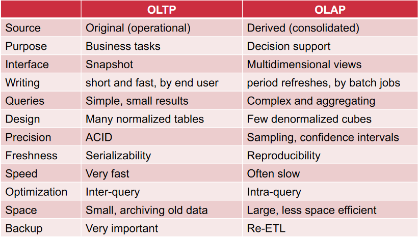

# Big Data Week 13 Questions
## OLTP vs OLAP

What is slow interactive? 

- Takes minutes, but still somewhat interactive.

What does OLTP stand for? 

- online transaction processing

What does OLAP stand for? 

- online analytical processing

What is the difference of access patterns between OLAP and OLTP? 

- OLTP: lots of small writes, exact/ no aggregates
- OLAP: lots of reads over big amount of data, that takes hours(or even more), aggregates

What is the most natural data shape for OLAP and OLTP respectively? 

- OLTP: tables
- OLAP: cubes

Why does OLTP not always normalise as much as possible? 

- It is read intensive and has little updates, so the run time save from not doing joins is bigger than the loss from more writes.

OLTP vs OLAP 

## Data warehouse

What are the properties of a data warehouse? 

- object oriented (single subject)
- integrated (of other databases, like a CRM, ERP)
- time variant (explicit in the reporting from 5-10 years)
- non-volatile (no updates, maybe increment every week)

What does ETL stand for? 

- Extract (from other databases)
- Transform (data cleaning)
- Load (sort, partition, indexing, integrity constraints)

What are some data cube dimensions? 

- where
- what
- what currencies
- when
- who

What is *slicing*? 

- Selecting/extract all the data with a given feature value.

What is *dicing*? 

- Often 2 dicers, aggregating over the remaining values given a slice and the feature to aggregate on.

What is the dimensionality of the data cube? 

- The number of dimensions of the cube is the number of columns with keys.

	
## ROLAP vs MOLAP

What is ROLAP? 

- query cubes similar to a RDBMS
- transparent with relational parents

What is MOLAP? 

- proprietary memory format, cube is less transparent

What is the difference between a raw data cube(ROLAP) and a formal data cube(MOLAP)? 

- the formal data cube is already aggregated and therefore may not have any duplicates.

What are measures in a fact table? 

- Different values (dimensions) given the keys, e.g. cost,profit

What are satellite tables? 

- Extra information tables that relate from the central table.

What is the star schema? 

- Each dimension in the main table has at most one satellite table.

What is the snowflake schema? 

- Satellite tables can have satellite tables.

	
## Drill down/roll up

What is a roll-up? 

- Combining all values of a feature to a more general aggregate; removing dicers.

What is drilling down? 

- Adding details/dicers to the results.

How can different drillings be used in the same fact sheet? 

- Use *null*

How can different groupings/rollups be used? 

- *group by grouping sets*/*group by roll-up*

What is *group by cube*? 

- Take the whole cube, the power set of the dimensions and group by each element of that powerset.

What is a cross tabulation? 

- The output of group by cube, where each cell is given and aggregates on all dimensions and sets of dimensions.

What is MDX and for which OLAP flavour is it used? 

- Multidimensional dimensional expressions
- Language/Model for MOLAP queries

What are the dimensions of MDX? 

- Measures/info
- Dimensions/columns

What are some benefits of MDX compared to fact sheets? 

- MDX is aware of hierarchies, similarly to trees.
- MDX allows to dice easily with on columns/rows

## Storing cubes

What is the syntax to store cubes? 

- XBRL

What are the files of XBRL? 

- XML, trees

Why was this file type used for XBRL? 

- XML is well established, can be used to check if the data is valid and it works in general

Why can we forget about the drawbacks of XBRL? 

- It is not highly efficient, but the database, where the file is fed into is more efficient.

	