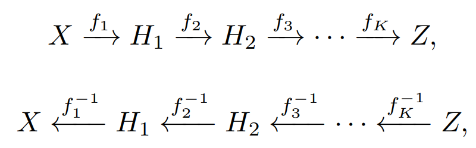

# FastFlow: Unsupervised Anomaly Detection and Localization via 2D Normalizing Flows

## Overview

Can be used as a plug-in module for feature extractors such as ResNet.

There are two parts of this model:

1. feature extractor extracts features in a 2D matrix
    1. such as ResNet 
    2. FastFlow even better, a Vision Transformer like ViT or CaiT
2. distribution estimation module transforms the extracted features to a simple representation, where OOD decisions can be taken more easily
    1. Uses a new 2D-normalizing flow
        1. Not that many parameters through patching
        2. Includes spatial awareness in both directions

FastFlow is of the representation-based kind of distribution estimation method.

## FastFlow

Normalizing Flows are transformations between data distributions with bijective transforms and therefore can be used in both directions. In our case the transformation is from extracted image data *X* to a multi-dimensional Gaussian distribution *Z*.

$p_X(x)=p_Z(z)|det(\frac{\partial z}{\partial x})|$

$log(p_X(x))=log(p_Z(f_\theta (x))+log(|det(\frac{\partial f_\theta (x)}{\partial x})|)$

With *f* being a mapping from *X* to *Z*.

Where *z* is normally distributed and $\frac{\partial f_\theta (x)}{\partial x}$ is the Jacobian of a bijective invertible flow model.

In the actual implementation, this *f* is comprised of many stacked smaller *f.* Like seen below.

Where each of those sub-steps is an affine coupling layer:

$$
\begin{align*}
y_a, y_b &= split(y) \\
y'_a &= y_a\\
y'_b &= s(y_a)\odot y_b+b(y_a)\\
y'&=concat(y'_a,y'_b)
\end{align*}
$$

Where *s()* and *b()* are neural networks, importantly for FastFlow, these networks are CNNs so the locality does not get lost. The splitting and concatenating is on the colour channel level.

## Experiments

### Setup

MVTecAD, BTAD and CIFAR-10 are used as datasets, where the last one is not an as straight-forward dataset, as there are no anomalies in the usual sense, but a different meaning, so the whole image is erroneous. AUROC is used as scoring function.

The baselines are CFLow, Patch Core and SPADE used on ResNet and CaiT extractors.

### Performance results

Compared to SPADE, FastFlow was 10x faster and achieving better scores through all the extractors. Patch Core took twice as long and often gave significantly worse performance. CFLOW is about 2/3rd as fast as FastFlow and in some configuration slightly edges out FastFlow, but in most configurations FastFlow performs better and sometimes beats CFLOW by a big margin. In a more extensive test on MVTecAD it was shown that CFlow and FastFlow perform similarly on pixel level AUC, also compared to other baselines, while FastFlow pulls away in image level AUC.

The comparison with autoencoders is even more damning, where FastFlow beats both classical VAEs as well as GANs quite convincingly on CIFAF-10.

### Other ablations

**Data augmentation** did not significantly augment performance with the deep feature extractors.

**Tampered test data** is also not a big issue for FastFlow still performs well, when the test set has been tampered with e.g. rotation or zooming.

**Kernel size** of the convolutional networks need to be adapted with the feature extractor. If the feature extractor is big, then an alternating kernel of 3x3 and 1x1 kernels is superior, while for smaller feature extractors such as ResNet pure 3x3 kernels are preferred. 

## Code

There does not exist a code base from the authors, but [this](https://github.com/gathierry/FastFlow) is an implementation that works similarly as well as the author’s. On the other hand, there is an implementation for [CFLOW](https://github.com/gudovskiy/cflow-ad).
