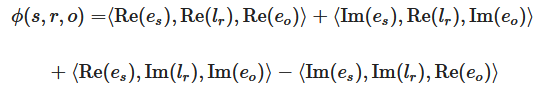

# [Preclinical validation of therapeutic targets predicted by tensor factorization on heterogeneous graphs](https://www.nature.com/articles/s41598-020-74922-z#Abs1)
## General
Try to find effective drugs, as most turn out in phase 2 and 3 to not be efficient enough. One way to find good drugs is to find the main proteins of the diseases, called *gene prioritization*.

Inference by matrix/tensor factorization; fill missing links and give probability of that edge existing.

Most interesting prediction is of Disease-Protein via Therapeutic Relationship.
## Data sources
### Nodes
- GeneProtein
	- [HGNC](https://www.genenames.org/)
	- [ensembl](https://www.ensembl.org/index.html)
	- [UniProt](https://www.uniprot.org/)
	- [Entrez Gene](https://www.ncbi.nlm.nih.gov/gene/)
- Diseases
	- [HGNC](https://www.genenames.org/)
	- [MeSH ontology](https://www.nlm.nih.gov/mesh/meshhome.html)
	- [OMIM](https://www.omim.org/)
	- [Disease Ontology](https://disease-ontology.org/)
	- [Orphanet](https://www.orpha.net/consor/cgi-bin/index.php)
	- [NCIT](https://ncit.nci.nih.gov/ncitbrowser/)
	- [UMLS](https://www.nlm.nih.gov/research/umls/index.html)
- Processes
	- [Gene Ontology](http://geneontology.org/)
	- [KEGG](https://www.genome.jp/kegg/pathway.html) 
	- [Reactome](https://reactome.org/)
- Compound
	- [ChEMBL](https://www.ebi.ac.uk/chembl/)
	- [Integrity](https://integrity.clarivate.com/integrity/xmlxsl/)
	- [CTD](https://www.ich.org/page/ctd).
### Edges
- Relations 
	- [ChEMBL](https://www.ebi.ac.uk/chembl/)
	- [Integrity](https://integrity.clarivate.com/integrity/xmlxsl/)
	- [CTD](https://www.ich.org/page/ctd)
	- [NHGRI-EBI GWAS Catalog](https://www.ebi.ac.uk/gwas/)
	- [DisGeNET](https://www.disgenet.org/)
	- [KEGG](https://www.genome.jp/kegg/pathway.html)
	- [OMIM](https://www.omim.org/)
	
There are three kinds of relations formed:
- EAT &rightarrow; Encode-Attend-Tag (only Disease-GeneProtein, also gives accuracy)
- SVO &rightarrow; Syntactic Subject-Verb-Object Edges (bidirectional biological associations [OpenIE?])
- LTE &rightarrow; Literature-based Therapeutic evidence (only Disease-GeneProtein, from titles based on rules)

There are different kinds of ends for the edges and they also have different information sources:
- GeneProtein &leftrightarrow; GeneProtein
	- [OmniPath](https://omnipathdb.org/)
	- [Biogrid](https://thebiogrid.org/)
	- [SigNOR](https://signor.uniroma2.it/)
	- [KEGG](https://www.genome.jp/kegg/pathway.html) 
	- [Reactome](https://reactome.org/)
- Process &leftrightarrow; Process edges are from [Gene Ontology](http://geneontology.org/) and have the four relationships:
	- "is a"
	- "regulates"
	- "part of"
	- "negatively regulates"
	- "positively regulates"
- Protein &leftrightarrow; GO process Therapeutic Link
	- [AmiGO](http://amigo.geneontology.org/amigo)
- Protein &leftrightarrow; GO process Biological Association
	- SVO
	- annotated edges.
- Disease &leftrightarrow; GO process Mechanistic Connection
	- [eDGAR](http://edgar.biocomp.unibo.it/gene_disease_db/)
	- [CTD](https://www.ich.org/page/ctd)
- Protein &leftrightarrow; Pathway
	- [KEGG](https://www.genome.jp/kegg/pathway.html) 
	- [Reactome](https://reactome.org/)
- Disease &leftrightarrow; Pathway 
	- [KEGG](https://www.genome.jp/kegg/pathway.html) 
	- [Reactome](https://reactome.org/)
	- EAT with some filtering.
- Disease &leftrightarrow; Compound Therapeutic Link 
	- [Integrity](https://integrity.clarivate.com/integrity/xmlxsl/)
- Protein &leftrightarrow; Compound
	- [ChEMBL](https://www.ebi.ac.uk/chembl/)L.
- Disease &leftrightarrow; Protein Biological Association
	- [NHGRI-EBI GWAS Catalog](https://www.ebi.ac.uk/gwas/)
	- [ChEMBL](https://www.ebi.ac.uk/chembl/)L
	- [DisGeNET](https://www.disgenet.org/) 
	- EAT edges.
- Disease &leftrightarrow; Protein Therapeutic Relationship
	- [CTD](https://www.ich.org/page/ctd)
	- [KEGG](https://www.genome.jp/kegg/pathway.html) 
	- [OMIM](https://www.omim.org/)
	- LTE edges. 

For better testing the graph is time-coded and trained on the previous knowledge and tested on the new knowledge.

Negative sampling was also used
## Relational inference for link prediction
Each entity and edge is embedded in a d-dimensional vector, which has to be learnt at training time.

Where the real and imaginary parts are supplied by [ComplEx](https://jmlr.csail.mit.edu/papers/volume18/16-563/16-563.pdf) and the < > stand for the [trilinear product](https://en.wikipedia.org/wiki/Triple_product).

[ComplEx](https://jmlr.csail.mit.edu/papers/volume18/16-563/16-563.pdf) scoring function to form a decoder.

## Tests
Find new drugs/treatments via tensor inference 

Predict success /failure of a treatment with classification on the embeddings

The model, Rosalind, outperforms the state-of-the-art and predicts the nearest discoveries best, what is sensible, since the literature the model was trained on is also closest to these discoveries.

## Problems
"One common issue with biological knowledge graphs is the presence of noisy (i.e. erroneous) data, limiting the power of relational inference algorithms. While Rosalind uses established biomedical databases and expert-validated text-extracted data for knowledge graph construction, these sources are noisy: biological data is often ambiguous or even contradictory."

"Lack of interpretability of predictions"