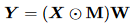
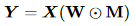

# [Learning Sparse Networks Using Targeted Dropout](https://arxiv.org/pdf/1905.13678.pdf)
## Introduction
Neural nets perform well because they are so flexible with their huge amount of learnable parameters.

To counter overfitting and reduce computation, *sparsification* can be used.
Sparsification removes some weights or entire units from the network, this can be done with regularisers or post hoc pruning.
## Unit dropout vs Weight dropout

Drops whole units.

Drops only weights/connections.
## Magnitude based pruning
A popular class of pruning strategies are magnitude-based which only keep the top-k largest magnitude weights.

Weight pruning gives better performance in the downstream task, but comes at a bigger computational cost, as it is less natural linear algebra compared to unit dropout.

## Targeted Dropout
Try to keep the loss small, but dimensionality of the weights still lower than k.

Instead of rigorously dropping the n-k lowest magnitude weights, of we take a &gamma;-partition lowest weights and drop them independently with probability &alpha;.

After one round there are (1-&gamma;&alpha;)n weights left. As a result the dependency of the important subnetwork on the unimportant subnetwork diminishes.

We can see dropout as the task to weed out the stable subnetwork from the more susceptible to noise (unimportant) subnetwork. 

## Experiments
ResNet and other well known networks on well known tasks CIAFR-10, ImageNet and WMT English-German Translation are studied.

Using a toy example, Targeted dropout is clearly better than no regularisation, in accuracy as well as the size of the important subnetwork.

For transformers the strategy makes hardly a difference until you prune more than 60%, where targeted on x% performs about as good as non-regularized dropout x-10%.