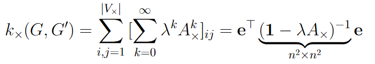

# [Weisfeiler Lehman kernel](https://ethz.ch/content/dam/ethz/special-interest/bsse/borgwardt-lab/documents/slides/CA10_WeisfeilerLehman.pdf)
## Goal
Find similarities between **graphs**, not just nodes. To do this, map the objects\(nodes) into a space, where the similarity can be checked, usually as an inner product, where the mapping acts as a **kernel**.

If the mapping is injective, then computing the corresponding kernel is as hard as deciding graph isomorphism \(which takes a lot of time). Therefore a good kernel is not injective, but still expressive.

## Kernels
**Walk-based kernels** check the common walks in two graphs.

### Product graph kernels
Algorithm:
1. form a direct product graph of G and G'

1. count the walks in this product graph
1. each found walk corresponds to a walk in each of the two input graphs

**Problems and fixes:**
- scales with O(n^6)
	- can be sped up via Sylvester Equations and Kronecker Product in O(n^3)
- **tottering** &rightarrow; can go back and forth between two nodes
	- can be avoided with a kernel based on shortest path distances, but scales in O(n^4)
- short walks are overweighted
	- can be avoided with a kernel based on shortest path distances, but scales in O(n^4)
	
### Subtree kernels
Subtree kernels compare all pairs of nodes and compare all subsets of their neighbours recursively.

The runtime is in O(*n*^2&times;4^*d*&times; *h*)
- *n* being the amount of nodes
- *d* being the neighbours
- *h* being the amount of hops in the neighbourhood
### Weisfeiler-Lehman Kernel
Algorithm, which can be used for *N* graphs simultaneously:
Repeat *h* times:
1. sorting &rightarrow; represent each node *v* as a sorted list of it's neighbours *L\_v*
	- O(*m*), *m* being the amount of edges
1. compression &rightarrow; compress this list into a hash value *h\(L\_v\)*
	- O(*m*) for a hash function *h* in O(1)
1. relabeling &rightarrow; label *v* with *h\(L\_v\)* as it's new label

This has runtime O\(*N* &times; *m* &times; *h*+*N*^2&times;n&times;h\)
- *N* concurrent graphs
- *m* edges
- *h* hash steps