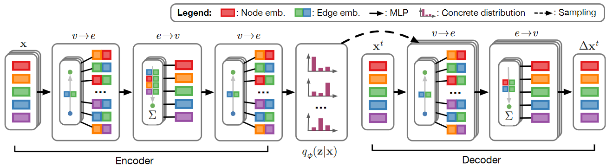
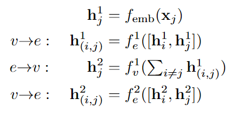

# [Neural Relational Inference for Interacting Systems](https://arxiv.org/abs/1802.04687)
## Introduction
Often, a system consists of multiple entities that depend on each other, like a player in a football game that moves according to the other players around him.

These systems can be *implicitly* modelled with a graph and then embedded using *graph neural networks* (GNNs), that send messages over the graph.

*NRI* allows for an explicit interaction structure over a **static**, latent graph.
## Graph neural networks
There are two types of messages in a graph:
- node_i-to-edge_{ij} sends ![h_\{ij\}^l=f_e^l\(\[h_i^l,h_j^l,x_\{ij}\]\)](https://latex.codecogs.com/gif.latex?h_%7Bij%7D%5El%3Df_e%5El%5C%28%5C%5Bh_i%5El%2Ch_j%5El%2Cx_%7Bij%7D%5D%29)
	- *l* is the layer
	- \[\] is a concatenation
	- *h* are the embeddings of the nodes
	- *x* is used for auxiliary edge/node features e.g. the type of edge/node
	- *f* is a edge/node-specific (neural net)-function
- edges_{kj}-to-node_j send ![h_j^\{l+1\}=f_v^l\(\[&Sigma;_{k \in Neighbourhood of j\} h_kj^l,x_j\]\)](https://latex.codecogs.com/gif.latex?h_j%5E%7Bl&plus;1%7D%3Df_v%5El%5C%28%5C%5B%5Csum_%7Bk%20%5Cin%20Neighbourhood_j%7D%20h_%7Bkj%7D%5El%2Cx_j%5C%5D%5C%29)
## Neural relational inference (NRI) model
The NRI model has two parts:
- an **encoder** that predicts the (latent) interactions given the (real) trajectories
- the latent dimension still is a graph
- a **decoder** that learns the (real) dynamical model given the (latent) interaction graph

As **input** there are *N* objects (nodes) at *T* times, which are denoted by *x_n^t*. We assume that the dynamics can be modelled by a GNN given an unknown graph *z*, with *z\_{ij}* being an edge in that graph.

A **prior** can be used on the labels, to enforce sparseness of the graph.

The model tries to predict many time steps, as only one time step might be too minimal and off to rounding errors, also the model does not try to predict *x^0*. 
### Encoder
The task of the encoder is to learn the correct of the *K* edge types for *z\_{ij}*.

This is done with a softmax on a GNN of the fully-connected graph.

There are two node-to-edge messages and one edge-to-node message, like in the picture, to make sure all the nodes learn everything, but the edges only know about the two ends.

The embeddings/functions are done either with MLPs or 1D-CNNs.
### Decoder
The decoder tries to give a good p(*x^{t}*|*x^{<t}*,*z*)

The decoder also uses GNNs, but can use a different neural network for every type of edge. An extension could add a GRU-like structure to use a recurrent style, which may be needed if the Markovian assumption does not hold. 

Using a continuous relaxation to make it learn something, an edge can have multiple labels, where one just takes the weighted sum.

The model tries to predict only the change since the last known timeframe and is modelled, such that the mean of normal distribution is predicted and the variance is fixed and does not get learnt.

## Experiments
One type of experiments is physics simulations, like springs or the [Kuramoto model](https://en.wikipedia.org/wiki/Kuramoto_model).
Another type of experiments is motion capture, where it could be shown, that more edges don't necessarily make the predictions much better, but better interpretable.

Results show that the found edges match with current knowledge even if there does not exist a clear golden graph. 

Another baseline for the encoder is the NRI, but given the real graph, instead of the learned graph. LSTM is smoother in the short-term, but has problems with interactions.