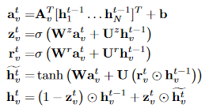
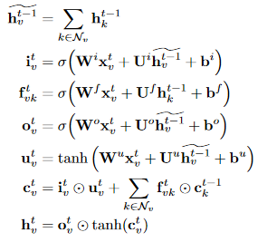

# [Graph Neural Networks: A Review of Methods and Applications](https://arxiv.org/pdf/1812.08434.pdf)
## Introduction
GNNs are a generalisation of CNNs, which are GNNs on special graphs, where the pixels are connected with each other and are in an Euclidean domain.

**Graph embeddings** represent parts of graphs in a low dimensional vector. Earlier embeddings like Node2Vec or DeepWalk do not share weights and are therefore quite inefficient as the number of weights grows with the amount of nodes and they can not deal with dynamic graphs or can generalise to new graphs.
### Contrast to CNN\/RNNs
RNNs have temporal constraints and CNNs need to be in the Euclidean domain. There is no order to the edges of a graph and even less so a temporal order, also the graph is not guaranteed to be Euclidean.

Another advantage of GNNs compared to earlier architectures is that GNNs can not only use the graph structure as features, but use it as part of the architecture itself, which not only helps in efficiency but also in interpretability.
## Different graphs
**Directed** graphs have directed edges, where one can distinguish between the *head*\/start and the *tail*\/finish of an edge. This makes it possible to use different weights\/procedures for the head-nodes compared to the tail-nodes. These kind of graphs make sense where order is important, e.g. for knowledge graphs.

**Undirected** graphs only have directed edges, where there is no such distinction. An undirected graph can be expressed with a directed graph using two directed edges in both ways instead of one undirected edge. 

**Heterogeneous** graphs have nodes of different types. The easiest way to encode this information is with one-hot encoding the type.

**Edge information** can be given with the edge, there might be the type of the edge or also an edge weight.
There are two ways to deal with this:
- create a virtual, bipartite graph, where the edges are also nodes and there is an edge from the original node to the original edge. There are no edges between two original nodes. 
- adapt different weight matrices for different kinds of edges.

**Dynamic** have a static graph structure, but dynamic input signals. Usually in the first step the graph structure is inferred and then the outputs are fed into a a sequence model like seq2seq or CNNs. 

## Vanilla graph neural networks
Vanilla graph neural networks are designed for *undirected* graphs.

A **local transition function**\(*f*\) is a function that updates the node according to the input neighbourhood.
- 
- which can be rearranged to *H*^{*t*+1}=F(*H*^{*t*},*X*), for all of them being matrices

A **local output function** \(*g*\) is a function that generates the output.
- o_v=g(h_v,x_v)
- which can be rearranged to *O*=G(*H*,*X_N*)

The **loss** is defined as the sum of all the supervised labels minus the output of these nodes. Updates are done with standard gradient methods.
### Limitations
1. it is inefficient to update the states of nodes *iteratively* for a fixed point.
1. vanilla GNNs use the same *f* in all layers, which is not modern any more, where the weights can adapt over layers. 
1. edges are under represented and do not have a good hidden state.
1. getting a lot of information washes out the nodes and makes it hard to distinguish them.
## Propagation types
### Important matrices
- Laplacian &rightarrow; *L*=*I_N*-*D*^\{\-1\/2\} *A* *D*^\{\-1\/2\}
- eigendecomposition &rightarrow; L=*U&Lambda;U^T*
- [\(positive\) pointwise mutual information \(PPMI\)](https://en.wikipedia.org/wiki/Pointwise_mutual_information) matrix 
### Convolution
There is a difference between *spectral* approaches, that work with a spectral representation and *non-spectral*\(spatial) approaches. Spectral approaches only work a graph structure and can not directly be applied to a graph with a different structure. In contrast, non-spectral approaches have to figure out a way to deal with different sizes of neighbourhoods, while still maintaining local invariances of CNNs.
- spectral models
	- **Spectral network** uses a convolution operation in the Fourier domain by computing the eigendecomposition of the graph Laplacian. And then use inference as *g*_&theta; &times; *x*=*U* *g*_&theta;(&Lambda;)*U*^T *x*, but this is computationally intense and non-spatially localised \(&times; here is a convolution\).
	- **ChebNet** is also a spectral network, but assumes *g*_&theta; &times; *x* can be approximated with a [Chebyshev polynomial](https://en.wikipedia.org/wiki/Chebyshev_polynomials) \(&Sigma;_\{o<order\}&theta;_o T_o\(~L\)x\), with ~L=2\/&lambda; L-I_N, &lambda; is the biggest eigenvalue of L. The Chebyshev approximation enables to not costly calculate the eigenvectors of the Laplacian. 
	- **Graph Convolution Network \(GCN\)** limits the layer-wise convolution to *order*=1 and approximates &lambda;=2, which makes it harder to overfit on the local neighbourhood structures. This leaves *g*_&theta; &times; *x* to &theta;\(3 *I_N*-2 *L*\)*x*. This model leads to numerical instability, but can be renormalised to fix that.
	- **Adaptive Graph Convolution Networks \(AGCN\)** work similar to GCNs, but learn a*residual* graph Laplacian, that they add to the original Laplacian matrix.
- non-spectral models
	- **Neural FPs** use different weight matrices \(W\_t^\{\|Neighbourhood\|\}\) for nodes with different degrees \(\|Neighbourhood\|\), but it can not applied to large-scale graphs with many node degrees.

		x=h\_v^\{t-1\}+&Sigma;\_\{*n* in Neighbourhood\}h\_n^{t-1}

		h\_v^t=&sigma;\(x W\_t^\{\|Neighbourhood\|\}\)
	- **Diffusion-convolutional neural network \(DCNN\)** uses a new function on matrices for node classification *H*=*f*(*W*^c &times; *P\** *X*\), where *P\** is the concatenation of the *K* first [power series](https://en.wikipedia.org/wiki/Power_series) of the degree-normalised transition matrix. The weights have size O\(*K* *F*\) and the hidden states have size in O\(*H* *K* *F*\). For graph classification there is a vector of ones in front of *P*\*.
	
		*H*=f(*W*^c \(element-wise multiplication\) *P*\**X*\)
	- **Dual graph convolutional network \(DGCN\)** tries to consider the local consistency as well as the global consistency and uses one convolutional network for each aspect and unsupervised ensembles them afterwards. The first network is a spectral AGCN. The second replaces the normal adjacency matrix with the PPMI
	
		*H*'\=&rho;\(*D\_P*^\{\-1\/2\}*X\_P* *D\_P*^\{\-\1\/2\}*H*&Theta;\), where *X\_P* is the PPMI matrix and *D\_P* is the diagonal degree matrix of *X\_P*.
	- **PATCHY-SAN** extracts and normalises the neighbourhood of exactly *k* nodes for each node.
	- **LGCN** uses CNNs as max pooling aggregators on nodes' neighbourhood matrices to get top-k feature elements and then applies a 1-D CNN for the hidden representations.
### GraphSAGE
GraphSAGE also uses convolutional, spectral propagation, but is one of the more popular architectures and uses the following equations:

*h*\_{neighbours *v*}^*t*=*AGG*\_*t*\(\{*h*\_*u*^\{*t*-1\} for *some* *u* in the neighbourhood of *v*\}\)

The neighbours are a fixed-sized number of uniformly sampled neighbours.

*h*\_*v*^*t*=&sigma;\(*W*^*t*\[*h*\_*v*^\{*t*-1\}\|\|h\_{neighbours *v*\}\]\)

*AGG*  could be one of many functions:
- *mean* &rightarrow; can be viewed as a form of *skip connection*
- *LSTM* &rightarrow; higher expressive capability, but are not permutation invariant
- *pool* &rightarrow; like in a CNN, use some weight function and non-linear function, afterwards a *max* or any symmetric function
### Gate
The vanilla **gated graph neural network \(GGNN\)** uses a GRU in the propagation step with &times; being the element-wise multiplication operation:

*v* aggregates the message from it's neighbours which is regulated by *A_v*, the sub adjacency matrix.

An adaption of the LSTM for trees, that gives each child *k* a forget gate *f_\{vk\}* is called the child-sum tree-LSTM and has the following unit:

### Attention
The **graph attention network \(GAT\)** uses attention, which is computed as

&alpha;\_\{ij\}=softmax\(LeakyReLU\(*a*^T\[*Wh\_i*\|\|*Wh\_j*\]\)\) normalised over all the *k*'s in the neighbourhood.

The output is *h'\_i*=&sigma;\(&Sigma;\_\{j in Neighbourhood\}&alpha;\_\{ij\}Wh\_j\)

This can also be extended to **multi-head attention** with concatenations\/summing over many attention modules.

The benefits of that is the parallelisability, the degree-invariance and that it can easily be applied to inductive learning problems.
### Skip connection
Sometimes deeper networks, that know more about the neighbourhood perform worse than the shallower networks, which have more important information and are less susceptible to noise. To alleviate that there are skip connections, that pass the some computations.

*T*\(*h*^*t*\)=&sigma;\(*W*^*t* *h*^*t*+*b*^*t*\)

*h*^\{*t*+1\}=*h*^\{*t*+1\} &times; *T*\(*h*^*t*\) + *h*^*t*&times;\(1-*T*\(*h*^*t*\)\), where &times; is again the element-wise multiplication operation.
### Hierarchical pooling
Much like in CNNs, there are pooling layers. **edge conditioned convolution \(CNN\)** uses a recursively downsampling function based on splitting the graph into two components by the sign of the largest eigenvector of the Laplacian.

**DIFFPOOL** uses the function *S*^*l*=softmax\(GNN_\{*l*,pool\}\(*A*^*l*,*X*^*l*\)\)
## Training methods
### Vanilla GCN
The vanilla GCN needs teh full Laplacian, what is computational consuming for large graphs. Also the amount of influences grows exponentially with the layers \(**receptive field expansion**\) and finally GCN is trained independently for a fixed graph, which makes it impossible to use inductive learning.
### Sampling
GraphSAGE, which was also explained uses sampling, additionally it changes the Laplacian with learnable aggregation functions, which are easier to compute and generalise better. Sampling is used to tackle receptive field expansion. This sampling can either be uniformly distributed like in GraphSAGE or weighted like in PinSage. Instead of sampling the neighbours, one can also sample the whole receptive field directly to speed up and reduce variance.
### Receptive field control
Uses the historical activations as a control variate to get a good approximation of the receptive field.
### Unsupervised training \(Graph Auto-Encoder\)
Instead of using a clear-cut training method graph autoencoders use normal GCNs to go to a vector representation and from this vector representation as close back to the original adjacency matrix.

*Z*=GCN\(*X*,*A*\)

*Ã*=&rho;\(*Z* *Z*^T\)
## General frameworks
### Message passing neural network \(MPNN\)
There are two phases:
- **the message passing phase** &rightarrow; runs for *T* steps and has two parts in each step, the *message passing* with **message passing function** *M_t* and the *node update* with **node update function** *U_t*
	1. *m\_v*^\{*t*+1\}=&Sigma;\_\{*w* in neighbourhood\} *M\_t*\(*h\_v*^*t*,*h\_w*^*t*,*e*\_\{*vw*\}\)
	1. *h\_v*^\{*t*+1\}=*U*\_*t*\(*h\_v*^*t*,*m\_v*^\{*t*+1\}\)
- **readout phase** &rightarrow; runs exactly *once* and aggregates the whole graph into one output
	1. *y*=R\(\{*h\_v*^*T*, for *v* in *G*\}\)
### Non-local neural network \(NLNN\)
NLNNs were introduced to capture long-range dependencies with deep neural nets. The non-local operation is a generalisation of the classical non-local mean operation in computer vision and computes the response at a position as a weighted sum of features at all positions, which is another way to say *self-attention*. The operation is defined as:
- *h'\_i*=1\/C\(*h*\)&Lambda;_\{*j* in *G*\} *f*\(*h\_i*,*h\_j*\)*g*\(*h\_j*\)
	- *f* &rightarrow; scalar, could be a Gaussian, an embedded Gaussian \(*self-attention*\),dot-product, concatenation with a ReLU
	- *g* &rightarrow; transformation of input *h\_j*
	- *C*\(*h*\) &rightarrow; normalisation, has to be adjusted to *f*
### Graph networks \(GN\)
A graph *G* consists of:
- *u* &rightarrow; a global attribute
- *H* &rightarrow; the set of nodes *h*
- *E* &rightarrow; the set of edges *e*
	- *s* &rightarrow; a sender (head)
	- *r* &rightarrow; a receiver (tail)

The updates are performed in **GN blocks** with three *update* functions &phi; and three aggregation functions &rho;
- updates
	- edge update &rightarrow; *e'\_k*= &phi;\_e\(*e\_k*,*h\_r*,*h\_s*,*u*\)
	- node update &rightarrow; *h'\_i*= &phi;\_h\(*ê'\_i*,*h\_i*,*u*\)
	- global update &rightarrow; *u'*= &phi;\_u\(*ê'*,*^h*',*u*\) 
- aggregations
	- node aggregation &rightarrow; *ê'\_i*=&rho;\_\{e h\}\(*E'\_i*\), where *E'\_i* are the updated incoming edges
	- global edge aggregation &rightarrow; *ê'*=&rho;\_\{e u\}\(*E'*\), where both *E'\_i* and *ê'* are global
	- global node aggregation &rightarrow; *^h'*=&rho;\_\{h u\}\(*H'*\), where both *H'\_i* and *^h'* are global
- there is no strictly enforced rule on the order of the updates and the aggregations

The graph networks adhere to some **design principles**:
- flexible representations &rightarrow; the architecture can fit to different scenarios in:
	- structure &rightarrow; amount of edges, degrees or nodes
	- task focus &rightarrow; *edge-focused*, *node focused* or *graph-focused* tasks
	- graph structure &rightarrow; *explicit*, when the structure is known or *implicit* if the structure can only be inferred
- configurable within-block structure &rightarrow; &rho; and &phi; can be modified and sorted differently
- composable multi-block architectures &rightarrow; the blocks can be composed by other blocks, which enables skip connections or RNNs
## Applications
Applications can be divided into two+ types:
1. structural scenarios &rightarrow; data has explicit relational structure
	- physical systems &rightarrow; *interaction networks*, objects are nodes and relations are edges
	- molecular fingerprints &rightarrow; from molecular graphs to their fingerprints, which is used in drug design
	- protein interfaces &rightarrow; used for cancer classification or in drug discovery and drug design
	- knowledge graphs &rightarrow; out-of-knowledge-base entity in knowledge base completion, also used for alignment across languages
1. non-structural scenarios &rightarrow; relational structure is not explicit
	- few-shot image classification &rightarrow; knowledge graphs can be used as extra information, the knowledge graph is only a sub-graph based on the found entities, there are three relation types: *super-subordinate*, *positive* and *negative* correlation.
	- visual reasoning &rightarrow; visual question answering, which is inherently multimodal also uses graph networks 
	- semantic segmentation &rightarrow; objects in images and their position to each other
	- text classification &rightarrow; either view each word as a node or rely on document citations
	- \(text\) sequence labelling &rightarrow; use POS tags where each tag is a node 
1. other scenarios &rightarrow; generative models, combinatorial optimisation problems
	- NetGAN &rightarrow; can generate graphs using random walks from another graph
	- combinatorial optimisation &rightarrow; usually NP-hard, like the travelling salesman or minimum spanning trees
## Open problems
The following problems are still open and should be addressed:
- shallow structure &rightarrow; GNNs are almost always shallow and go only up to three layers mostly. This is due to over-smoothing, as all vertices will go to the same value
- dynamic graphs &rightarrow; at the time of this paper, there was no establish way to deal with dynamic graphs, where edges and nodes may appear or disappear
- non-structural scenarios &rightarrow; there is no optimal and well-established method to generate graphs from raw data
	- for *images* CNNs are used to form superpixels or objects and they can be connected
	- for *text* syntax trees or fully connected graphs are used
- scalability &rightarrow; especially in the internet graphs can be enormous and pose some problems, as batches may not be applied and computing the Laplacian is not feasible