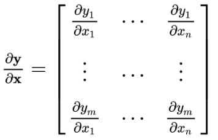
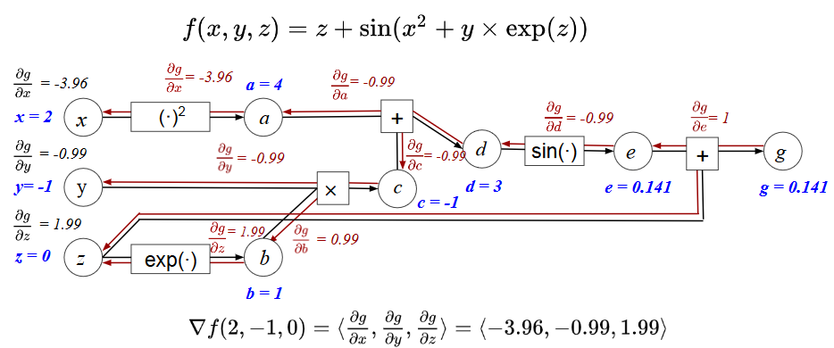
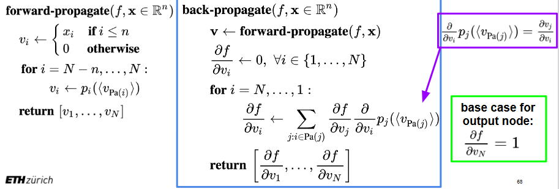
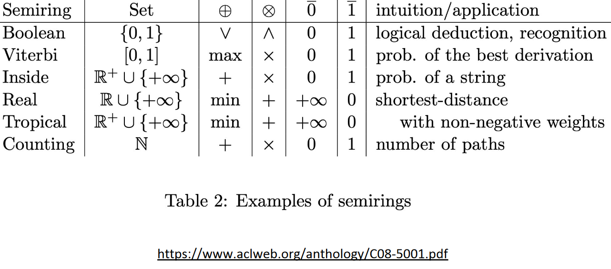
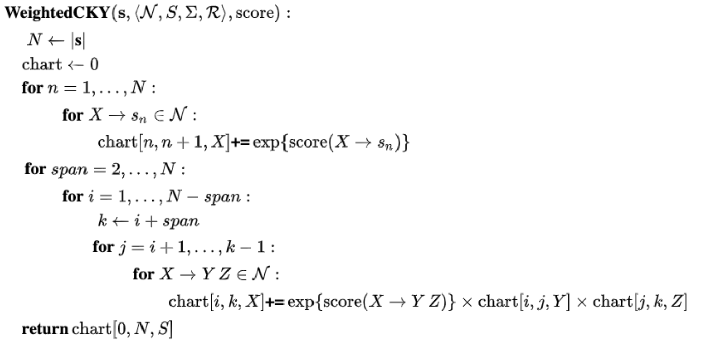
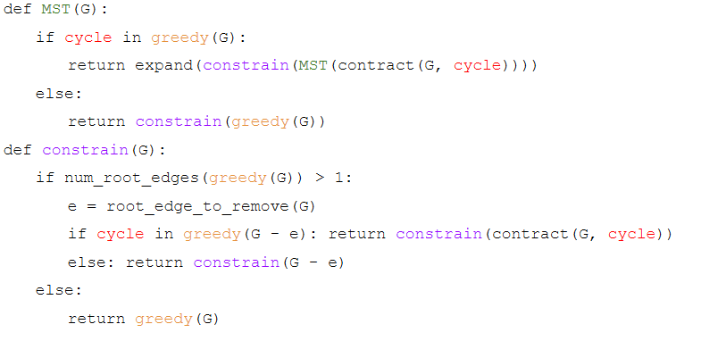

# NLP Questions
## Lecture 01

What is the difference between  competence and performance? 

- Competence is an ideal, performance can be realised.	

Is natural language context-free? 

- No, e.g. Swiss German is not context free.	

What do linguists study? 

- **phonology** &rightarrow; study of sound abstraction
- **morphology** &rightarrow; study of word building
- **syntax** &rightarrow; study of word order
- **semantics** &rightarrow; study of meaning	

What is NLP? 

- A set of methods and algorithms for making natural languages accessible to computers.
	- **Analysis** Natural language &rightarrow; computer representation
	- **Generation** computer representation &rightarrow; natural language
	- **Acquisition** of knowledge in text and translating it to computer accessible information
	

Why is NLP hard? 

- Natural language structures can have different meanings depending on context and dialects/slang (e.g. "West Bank" vs. "money bank")
- What is a good computer representation for different natural constructs/tasks.
- Noise in the linguistic input.
- Bias in the representations.

## Lecture 02

What is the chain rule? 

- The derivation rule of a composite function.
	- &nabla;(f(g(x)))=&nabla;f(g(x))\*&nabla;g(x)

What is backpropagation? 

- A linear-time dynamic program algorithm for computing derivatives that uses the chain rule.
- Automatic differentiation in reverse-mode.

What is the runtime of backrprop?  

- The same as "forwardprop" to compute the function.

What is the formal definition of derivatives? 

- &nabla;f(x)=(f(x+h)-f(x))/h for h going to 0

What is a Jacobian? 

- It is the first derivative of a vector given another vector.

What is the chainrule in the multivariate case? 

- (&nabla;z_k)/(&nabla;x_i)=&lambda;_y(&nabla;z_k)/(&nabla;y_j)(&nabla;y_j)/(&nabla;x_i)

What is a hypergraph? 

- The same as a graph, but an edge can have many sources.	

What is the bound of a naive implementation of backprop? 

- O(2^n)

What is the bound of backprop? 

- O(n)

What are the building blocks of automatic differentiation? 

- Split up the big function in many simple functions and their derivatives, that you have already pre-computed e.g. sin(x).

What are the steps in the automatic differentiation framework? 

1. Write the long function as a hypergraph with the intermediate variables as nodes.
1. Do a forward pass to compute the function. 
1. Run backprop on the same graph using the stored forward values.

Give an example of autodiff 

Show the forward- and backprop algorithms 

What are the three types of differentiation? 

- Symbolic (like with pen and paper)
- Numerical (compute the function for f(x) and f(x+h) and then use the definition)
- Autodiff (as seen)

## Lecture 03

What is a random variable on a high level? 

- A random variable is a function that maps outcomes of random experiments to a set of properties. 

What is a probability distribution? 

- P(X=x) is a function that measures the probability that outcomes with a particular property *x* will occur.

What is the difference between discrete and continuous probabilities? 

- Continuous probabilities are defined over an interval, while discrete probabilities are defined over values/points.

What are the three axioms of probability? (in the discrete case) 

1. **Non-negativity** &rightarrow; p(X=x)>= 0
1. **Sums to 1** &rightarrow; &lambda;_x p(X=x) =1
1. **Countable Additivity** &rightarrow; p(x **or** y)=p(x)+p(y)-p(x **and** y)

What is marginalisation of a joint probability? 

- We *integrate out* one variable of the probability:
	- p(x)=&lambda;_y p(x,y)

What is the formula for a conditional property? 

- p(x|y)=(p(x,y))/p(y)

What is Bayes' Rule? 

- posterior=(likelihood\*prior)/evidence
- p(y|x)=(p(x|y)p(y))/(&lambda;_y p(x|y)p(y))

What are the necessary conditions for two random variables to be independent? 

- *x* and *y* are independent if:
	- p(y|x)=p(y)
	- p(x|y)=p(x)

What is the joint probability of two independent variables? 

- p(x,y)=p(x)p(y)

What is the expectation of f(x)? 

- E[f(x)]=&lambda;_x f(x)p(x)

What are the three expectation rules? 

1. **Linearity** &rightarrow; E\[k f(x)]=k E\[f(x)], if k is constant
1. **Linearity of sum** &rightarrow; E\[f(x)+g(x)]=E\[f(x)]+E\[g(x)]
1. **Multiplication of independent variables** &rightarrow; E\[f(x)g(y)]=E\[f(x)]\*E\[g(y)], if *x* and *y* are independent

What are the three parts of a probability space? 

- Sample space
	- The set of all possible outcomes of an experiment.
- Event Space
	- The space of potential results of the experiment, it has to be a subset of the sample space, often the powerset.
- Probability function
	- Maps an event to a probability or a degree of belief

Give an example of an independent and one of a correlated probability space 

- Probability spaces are not independent or correlated, only random variables can be.

What is the general form of a log linear model/the exponential family? And can you explain the parts? 

- p(y|x,&theta;)=1/Z(&theta;)h(y)exp(&theta;\*&phi;(x,y))
	- Z(&theta;) &rightarrow; **partition function**, so that it sums to 1, Z(&theta;)= &lambda; _y exp(&theta; \* &phi;(x,y)) 
	- h(y) &rightarrow; determines the **support**/ exact zeros in the model.
	- &theta; are the **canonical parameters**/ weights
	- &phi;(x,y) are the **sufficient statistics**/ score
	

What is the (runtime) problem of the log linear model? 

- The normalizing constant Z takes very long to compute, as every possibility has to be checked.

What is the goal of preprocessing? 

- Raw text should be converted to a format that can be handled nicely by the computer/score function.

What are some preprocessing steps? 

- Tokenisation
- Lower casing
- Stemming
- Stop word removal
- Reducing vocabulary

What are some features? 

- n-grams
- One-hot encoding
- Bag-of-words
- Word embeddings (GloVe, BERT etc.)
- Bag-of-embeddings
- Domain-specific features
	- use domain knowledge to refine some other models

What is the big use of convex functions for machine learning? 

- Any local minimum is automatically a global minimum, but unfortunately, many functions are (not proven) convex.

What happens at the global minimum of the log likelihood of a log linear probability? 

- L=-&Lambda;_n log(p(y_n|x_n,&theta;), for p being in the log linear model.
- &nabla;L(&theta;)=&Lambda;_n=&phi;(x_n,y_n)-&Lambda;_n&Lambda;_y' p(y'|y_n, &theta;)&phi;(x_n,y')=0
	- **Expectation matching** &rightarrow; the observed feature counts on the left are equal to the expected feature count on the right.
	

What is the definition of the softmax function? 

- softmax(h,y,T)=exp(exp(h_y/T))/&Lambda;_y' exp(h_y'/T), for h_y = &theta;\*&phi;(x,y)
	- *T* being the temperature
	- The higher *T*, the better spread the probability mass is.
		- In the case of 0 (softmax) all probability mass is on the maximum
		- In the case of infinity, the probability mass is (close to) uniformly distributed.

What is the gradient of the log-softmax function? 

- &nabla;_&theta; log(softmax(&theta;&phi;(x,y),y)=f(x,y)-E_y'\[f(x,y')\] for y' being chosen according to the softmax

What are the benefits of the exponential family? 

- Finite sufficient statistics
	- We can compress the whole function in few parameters without loss of information
- Conjugate priors
	- e.g. for Bayesian machine learning
- Corresponds to maximum entropy distribution
	

What function is not in the exponential family? 

- E.g. the beta function.

What is the definition of entropy? 

- H(p)=-&Lambda;_x p(x)log(p(x))

## Lecture 04

What is a Multilayer Perceptron? (MLP) 

- MLPs are a subtype of Neural Networks, which are fully-connected feed-forward Neural Networks.
- It does classify an input into two classes \[-,+]

What is the definition of the sigmoid function? 

- sigmoid(x)=&sigma;(x)=(exp(x))/(1+exp(x))=1/(1+exp(-x))

How does the sigmoid relate to the softmax? 

- Sigmoid is a binary softmax.

How is a hyperplane defined in variables? 

- It is a vector *a* of the same size + the constant.
	- a_1\*x_1+...+a_N\*x_n=b 

What is linear separability? 

- If the classes can be split by a hyperplane.

How can we induce non-linearity in a log linear model? 

- Use a non-linear score/embedding function &phi;(x).

What is the deciding factor for choosing an embedding function? 

- The decision function should be drawable with the embedded log linear model.

What are the building blocks of the MLP? 

- h^(N)=&sigma;(W^(N)...&sigma;(W^(2)&sigma;(W^(1)e(x))))
	- h is a vector of the size of *classes*
	- &sigma; is a non-linear function, e.g. the sigmoid
	- W^(l) are linear multiplications/**projection layers** with the weights of that layer (*l*)
	- e(x) is the embedding of x
- p(y|x)=exp(h^(N)_y)/(&lambda;_y' exp(h^(N)_y'))
	- the softmax on the last layer

What and how are we training an MLP? 

- We learn the weights and the embedding by maximizing the log-likelihood of the training data with a gradient based method (gradient descent or Newton's method is also possible)
- TO get the gradient one can use backprop.

What is a perceptron? 

- A log-linear model with a specific setting of hyperparameters:
	- Temperature *T* to infinity
	- Trained with gradient descent and batch size 1 example (**perceptron update rule**)

Which functions can the MLP approximate and what is the drawback? 

- A one-hidden-layer MLP can approximate any function in the unit cube, but it may need a huge amount of hidden nodes. 

What is pooling in neural networks? And what are some examples?

- The aggregation of many inputs (e.g. tokens) into one more general:
- Some examples are 
	- **Max-pooling** &rightarrow; only take the biggest signal
	- **Mean-pooling** &rightarrow; take the mean of all signals
	- **Sum-pooling** &rightarrow take the sum of all signals

What is the skip-gram training objective? 

- Estimate the central word, given the words in a window around it/context.
- Maximize p(*word*|*context*)=1/Z(*context*)\*exp(e_wrd(word)\*e_ctx(context))
	- for e_wrd being the central embedding and e_ctx being the context embedding

What do we utilise for the final model from the skip-gram training? 

- We only use word embedding of the skip-gram training as our embedding &phi;(word) and we throw the skip gram model away. 

How can word embeddings be evaluated? 

- Cosine similarity (dot product)
	- cos(u_i,u_j)=(u_i \* u_j)/(||u_i||\*||u_j||)
- Word analogies (Vector geometry on embeddings)
	- E.g. check the difference of e(king)-e(queen)=e(man)-e(woman)

What is the difference between a contextual and a non-contextual embedding? 

- Non-Contextual embeddings only have one embedding per word, whereas contextual embeddings may have many embeddings per word; one per word X context.

What is the tf-idf model? 

- tf(token,doc)\df(token,corpus)
	- **tf** &rightarrow; term/token frequency, how often have we seen the term in the doc
	- **df** &rightarrow; document frequency, how often have we seen the term in the corpus?

## Lecture 05

What is structured prediction? 

- Multi-class classification with some algorithmic tricks.
	- The class space can be huge, e.g. all possible strings and not just +/-.

What is the Kleene closure? 

- All possible outputs, which (often) is infinitely large, e.g. V\*

Where comes the language model in, when having a prefix tree? 

- A language model is the weighting of the prefix tree.

What are the constraints of a language model on a prefix tree? 

- At each node, the edges out must not be negative and sum to 1.

What is the difference between global normalisation and local normalisation of language models? 

- In **global normalisation** we need to come up with a smart idea to regularise the whole problem, unfortunately, there is no all-purpose trick.
- In **local normalisation** we make sure that at every node the weights of the outgoing edges to finite lengths sum up to 1 (by dividing by the sum of all outgoing edges).

What is a problem when using local normalisation? 

- We must make sure that every path with "infinite" length has no probability mass, this can be done by demanding that each node has a *End of sentence* node as descendant.

What is the difference between a tight and a non-tight language model? 

- A **non-tight** model may have infinitely large structures.
- A model sums to 1 (has no probability mass wasted) is called **tight**.
	- We can ensure a model is tight by enforcing p(EOS|parent)>0.

What is the n-gram assumption? 

- Every word only depends on the last *n* previous words, where *n* is a hyperparameter.

What is a nice side effect of using word embeddings in terms of runtime and stability? 

- The embedding usually is in a constraint vector space, as opposed to the almost infinite choices of words in the vocabulary.

What is the architecture of a RNN model? 

- p(y_t|y_<t)=exp(&theta;_y_t\*h_t)/&Lambda;_y' exp(&theta;_y'\*h_t)
	- y_t is the current token
	- y_<t is the history
	- **current embedding** x_t=&phi;_y_t
	- **hidden state** h_t=f(x_t,h_t-1)

What does it mean if some parameters are tied? 

- The tied parameters are often shared or at very least heavily constraint according to other parameters.

What makes RNN backprop through time special? 

- Nothing, unroll and use backprop, like with other architectures.

What is Lidstone or &lambda;-smoothing? 

- p_smooth(y_t|y_t-1)=(count(y_t-1,y_t)+&lambda;)/(&Lambda;_y' count(y_t-1,y')+V&lambda;)

What are the benefits of &lambda;-smoothing? 

- Takes from those who have counts to spare and redistributes it to those that do not have enough/any counts.
	- This makes p(w)=0 impossible.

Is there some mathematical justification for the &lambda;-smoothing? 

- Yes, this corresponds to a Bayesian model with a Dirichlet prior.

## Lecture 06

What are part of speech tags? 

- A grammatical category, e.g. verb, noun, determiner (Pronomen)

What are conditional random fields (CRF)? 

- The CRF is a conditional probabilistic model for sequence labelling which are built on the logistic regression classifier.

What are the properties a good score function has to fulfil to be used in a CRF? 

1. Higher means better.
1. The score decomposes additively
	- score(*tags*, *words*)=&Lambda;_n score(<*tag*_n-1,*tag*_n>,words)
1. If score is parametrised, it should be differentiable to allow backprop.

Where and why are special tokens used when translating? 

- At the beginning and/or the end there are special tokens needed, which are not in the original language, to show the beginning/ending of the sentence.

What is the reason why we use this kind of score function in a CRF? 

- The normalising constant was previously in O(T^N) to compute, with the correct tricks and assumptions, this goes down to O(T\*N).
	- *T* being the amount of tags
	- *N* being the length of the sentence

How does this trick work? 

![\begin{flalign*}
\begin{aligned}
&\sum_{t\in\mathcal{T}^N} exp(\sum_{n=1}^Nscore(<t_{n-1},t_n>,w))\\
&=\sum_{t_{1:N}\in\mathcal{T}^N} \Pi_{n=1}^Nexp(score(<t_{n-1},t_n>,w))\\
&=\sum_{t_{1:N-1}\in\mathcal{T}^{N-1}}\sum_{t_{N}\in\mathcal{T}} \Pi_{n=1}^Nexp(score(<t_{n-1},t_n>,w))\\
&=\sum_{t_{1:N-1}\in\mathcal{T}^{N-1}} \Pi_{n=1}^Nexp(score(<t_{n-1},t_n>,w)) \times \sum_{t_{N}\in\mathcal{T}}exp(score(<t_{N-1},t_N>,w))\\
&=\sum_{t_{1}\in\mathcal{T}} exp(score(<t_{0},t_1>,w)) \times  \sum_{t_{2}\in\mathcal{T}}exp(score(<t_{1},t_2>,w)) \times \dots \times \sum_{t_{N}\in\mathcal{T}}exp(score(<t_{N-1},t_N>,w))
\end{aligned}&&&&
\end{flalign*}](./images/CRF.PNG)

How can the maximal score be found? 

- Viterbi
	- score(words, tags_n)=max_t_n+1 exp(score(<t_n,t_n+1>, words))\*score(words,t_n+1)
	- Take the highest score at the Beginning of sentence.

What are the five parts of a semiring? 

- *A* &rightarrow; the alphabet
- + &rightarrow; an additive function
- x &rightarrow; a multiplicative function
- 0 &rightarrow; an identity of the addition (also an annihilator for x)
- 1 &rightarrow; an identity of the multiplication

What are the four necessary properties of a semiring? 

1. (A,+,0) is a [commutative monoid](https://en.wikipedia.org/wiki/Monoid#Commutative_monoid).
1. (A,x,1) is a [monoid](https://en.wikipedia.org/wiki/Monoid).
1. x distributes over +
	- (a+b) x c = (a x c)+(b x c)
	- c x (a+b) = (c x a)+(c x b)
1. 0 is an annihilator for x, 0 x a = a x 0 = 0

Can you give some examples of semirings? 

Why can't we just simply plug-in/out semirings? 

- We need to check that we plug-in/out the correct semiring and it gives us the result of the problem we want to solve.

How do CRFs correspond to a softmax? 

- CRFs are a big structured softmax.
	- **CRF**: max(&Sigma;_i(score(tokens^(i),words^(i))- log( &Sigma;_{tag' in T^N} exp(score(tag',words^(i))))))
	- **Softmax**: max(&Sigma;_i(score(tokens^(i),words^(i))- T\*log( &Sigma;_{tag' in T^N} exp(score(tag',words^(i))/T))))
		- Which is equal if T approaches 0
		

## Lecture 07

What is a constituent? 

- A constituent is a word or a group of words that functions as a single unit within a hierarchical structure.

Is there for every sentence a clear best constituency parsing? 

- In general, no.
	- There are (artificial) languages which allow a much clearer parsing.
	- But even then, it depends on the task you want to execute, as many constituents are ambiguous.

Formally, what is a grammar? 

- A grammar is an (ordered) set of rules describing how to form sentences/strings from a vocabulary. 

When is a grammar ambiguous? 

- A grammar is ambiguous if there is more than one way of generating the same string.

What is a context-free grammar? 

- In a context-free grammar rules can be applied to non-terminals, without looking at the surrounding/context.

What are the four building blocks of a context-free grammar? 

1. A set of non-terminal symbols
1. A start non-terminal
1. An alphabet of terminal symbols
1. A set of production rules

What is the difference between a terminal and a non-terminal? 

- A non-terminal can produced further, while a terminal is the last symbol of this production line.

What are the two allowed actions in Chomsky normal form? 

- Non-terminal &rightarrow; Non-terminal Non-terminal
- Non-terminal &rightarrow; Terminal
	- There could be different Non-terminals in those rules, not just one

How can you point out a constituent in a parse tree? 

- Every node in a parse tree is a constituent. Including the start.

Where comes probability into probabilistic context-free grammars (CFG)s? 

- The production rules get a probability of being used.

What is the probability of a parse tree? 

- It is the multiplicative sum of the probability every production rule used.

Are probabilistic CFGs locally or globally normalised? How is that done? 

- PCFGs are locally normalised and this is done by requiring that for every non-terminal the probabilities of production rules starting from that non-terminal must sum up to 1. 

What is the difference between a weighted CFG vs. a probabilistic CFG? 

- In a weighted CFG, the weights can be arbitrarily non-negative, while in a probabilistic CFG, the weights must be non-negative, summing up to 1 probabilities.

What is the downside of using a weighted CFG instead a probabilistic CFG? 

- The probabilities are not naturally normalised, meaning we need to compute Z, which in the case of weights means that we must check every possible parse-tree, what can be really expensive.

What is probabilistic parsing? 

- The probability of a parse tree, given a sentence.
	- For unambiguous grammars, this probability is 1 for every valid sentence.

What is the yield of a parse tree? 

- The yield of a parse tree is the string it generated.

What does the Chomsky Normal Form (CNF) theorem state? 

- For any grammar, there exists a grammar in CNF, that accepts the same set of strings.
	- The trees might look completely different.

If the grammar is in CNF, how many parse trees might there exist? Why is it like that? 

- There are a Catalan number of trees, which is exponential, but finite. There can't be an infinite amount of trees as there are no more cyclic rules. 

What is the runtime of CKY? 

- O(N^3\*R)
	- *N* being the length of the sentence
	- *R* being the amount of rules 

Why did we talk about Chomsky normal form in this lecture? 

- CKY needs the grammar to be in CNF for it to work.

Write down the CKY algorithm. 

## Lecture 08

How are dependencies in a dependency tree encoded? 

- Dependencies are directed and labelled relations that point from a word or the root to another word.
	- Labels are often syntactic rules like *object-of-verb* 

What is the difference between a projective and a non-projective dependency tree? And how can you spot them? 

- **Projective dependency trees**
	- no crossing arcs/relations
	- can often be viewed as a version of CKY
- **Non-projective dependency tree**
	- crossing arcs/relations
	- can not be solved with CKY

What is the edge-factored assumption? 

- The score function is a multiplicative sum of scores:
	- p(tags|words)=1/Z &Lambda;_edge(i&leftarrow;j) exp(score(i,j,words))exp(score(root,words))

What is in the cells of an adjacency matrix? 

- A_ij=exp(score(i,j,words)).
- p_j=exp(score(j,words)) &rightarrow; for the root

What does Tutte's Matrix-Tree Theorem (MTT) provide and what is it's runtime? 

- Tutte's MTT can provide the normalizing constant for all directed trees in time O(n^3).

What is the input for Tutte's MTT? 

- The Laplacian matrix L with L_ij:
	- *i*=1 &rightarrow; p_j
	- *i*=*j* &rightarrow; &Lambda;_i'=1^n A_i'j, for i' unequal to i
	- *else* &rightarrow; -A_ij
	With: 
		- A_ij=exp(score(i,j,words)).
		- p_j=exp(score(j,words)) &rightarrow; for the root

How can the dependency problem be mapped to a graph? 

- Words/tokens are nodes in the graph.
	- There is a special root node, that is not a word.
- Relations are weighted and labelled edges.
- Parses are subgraphs, e.g. trees.

What are the properties of a valid dependency parse? 

- All non-root nodes have exactly one incoming edge.
	- The root by definition has none.
- No cycles &rightarrow; a tree
- Only one outgoing edge from the root.
- All nodes must be connected &rightarrow; spanning

What is Kruskal's spanning tree algorithm and what is it's runtime complexity? 

- Always take the biggest edge that connects the current tree with a new node.
- Runs in O(*E* log(*E*))
	- *E* being the number of edges

Why does Kruskal's spanning tree algorithm not work? 

- The (root) constraints might be a problem. Also vanilla Kruskal's does not work well with directed trees.

What is the directed MST algorithm and what is it's runtime? 

- Runs in O(n^2)

