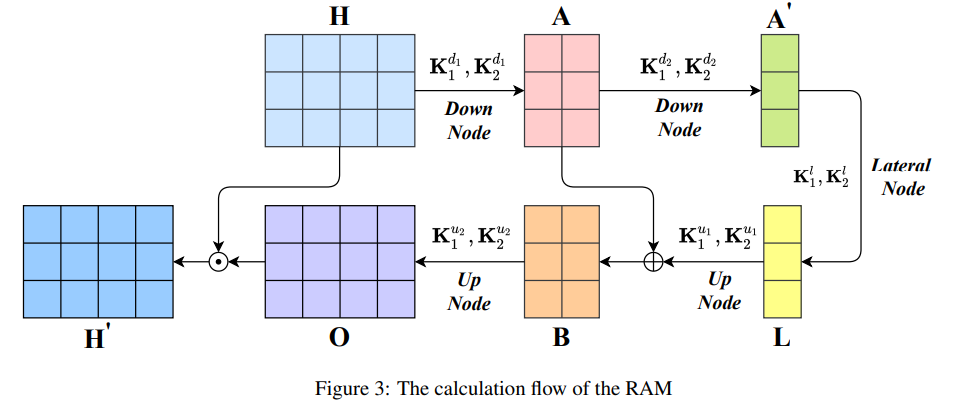
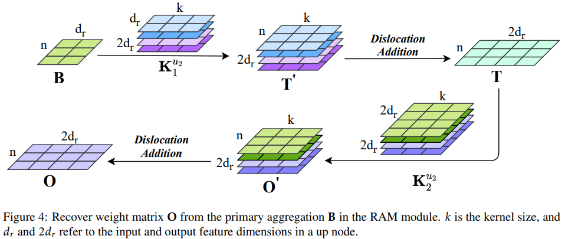

# [Multitask Recalibrated Aggregation Network for Medical Code Prediction](https://arxiv.org/abs/2104.00952)
## Introduction
This paper tackles the problem of automatic ICD-coding of clinical notes. To do so, multitask learning and a recalibrated aggregation module (RAM) are introduced.
## Method
### Standard Bi-GRU
The words are embedded using word2vec and then fed into a BiGRU, that consists of one forward and a backward GRU, which both emit a hidden state that get concatenated together to generate the Bi-GRU hidden state.
### Recalibrated aggregation module (RAM)
The Bi-GRU hidden state (*H*) then gets fed into the RAM, which uses up- and downsampling to be less error prone and better focus on more important parts.

The RAM has two down nodes that perform downsampling, where the &and; is a dislocation addition and *K* are learned weight matrices:
$$ A=\wedge_{n=1}^{d_r}(K_2^{d_1}(tanh(\wedge_{m=1}^{d_r}(K_1^{d_1}H)_m))_n) $$
As well as two nodes for upsampling.

### Attention and classification layers
Afterwards, the document representation *H'* then get attended specifically for each code with a softmax between *H'* and the parameter matrix of the code query *U*. The attention then gets applied to *H'* again to get the attended feature vector. After a fully connected layer a sigmoid is used to produce the probability for a label.
### Multitask training
There are two coding standards with ICD and CCS, which both are a multi-label classification problem, that use binary cross entropy loss, which then get added together for a combined loss.
## Experiments
MIMIC-III is used in the full and 50 mode. Adam performs about best and converges faster than other optimisers.
CAML, HyperCore and MultiResCNN are used as baselines, which perform better the further down the list, with MT-RAM best.
Multitasking as well as the RAM augmented performance if used on CAML, MultiResCNN and the here used Bi-GRU, with BI-GRU performing best.
