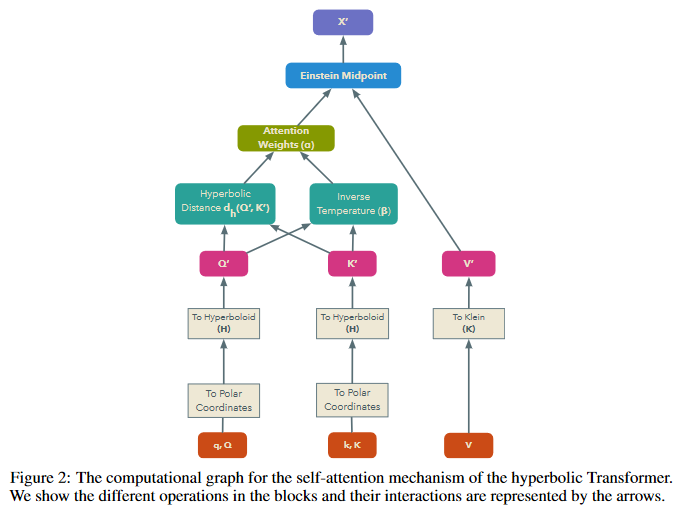

# [Hyperbolic Attention Networks](https://arxiv.org/abs/1805.09786)
## Hyperbolic models
### Hyperboloid model
The hyperboloid is constrained by the set where the **Minkowski bilinear form**:
$$ <q,k>_M =\sum_{i=1}^n q_i k_i - q_{n+1} k_{n+1} $$
is -1 for the *inner product* of positive n+1 coordinates.

The distance metric then is $$ arccosh(-<q,k>_M) $$.
### Klein model
A point from the hyperbolic model can be projected to the Klein model \(which is a n-dimensional ball with radius smaller than 1\) with:
$$ \pi_{H \rightarrow K}(x)_i=\frac{x_i}{x_{n+1}} $$

This gives the inverse of:
$$ \pi_{K \rightarrow H}(x)=\frac{1}{\sqrt{1-\Vert x \Vert} (x,1) $$

The distance then is the hyperboloid distance of the projections of the Klein representations to the hyperboloid space.
## Hyperbolic attention

To use attention in the hyperbolic space there has to be:
- a mapping from euclidean space to hyperbolic space
- a matching function for the attention weight
- an aggregation function to combine the different attention vectors
### Hyperbolic mapping
A pseudo-polar mapping is introduced, which consists of a radius *r* and a normalised *n*-dimensional angle vector *d*. The used function to project is $$ \pi_{K \rightarrow H}(d,r) $$
### Hyperbolic matching
For the matching the distance between the query and the key is used in a softmax or a sigmoid.
### Hyperbolic aggregation
The Einstein midpoint *m* is used, which uses the Lorentz factor &gamma;
$$ \gamma(v_{ij})=\frac{1}{\sqrt{1-\Vert v_{ij} \Vert ^2} $$
$$ m_i(\{\alpha\}_j, \{v_ij\}_j)=\sum_j (\frac{\alpha_{ij}\gamma(v_{ij})}{\sum_l \alpha_{il}\gamma(v_{il})} v_{ij} $$
## Experiments
The hyperbolic version perform better in all tested disciplines. Those were:
- link prediction in graphs
- shortest path length prediction in graphs
- visual question answering
- neural machine translation