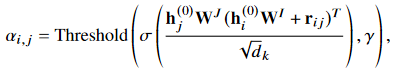

# [SumGNN: Multi-typed Drug Interaction Prediction via Efficient Knowledge Graph Summarization](https://arxiv.org/abs/2010.01450)
## Introduction
Adverse drug-drug interactions \(DDI\) are a big health risk and should be averted. Many are already known, but especially finding DDI for a new drug, remains an important problem, which entails a huge amount of experiments. To combat that, machine learning can be used to not test everything.

Newer approaches additionally use knowledge from either small, curated DDI networks or vast and noisy mined knowledge graphs.
## Problem setting
Nodes are drugs. Edges are \(adverse\) effects. Finding drug interactions is therefore a link prediction problem.

Nodes are embedded using TransE.
## Method
SumGNN consists of three modules:
- elect local subgraph in the KG around the two drugs in the pair
- summarise the local subgraph
- use the encoding for prediction
- training
### Extract local subgraph
Around the drugs we want to test, extract the k-hop neighbourhood. Keep only the enclosing subgraph, nodes which are in both k-hop neighbourhoods. The embedding for sumGNN then consists of the node embedding and the one hot embedding of the distance to the interesting nodes.
### Knowledge summarisation
Uses self-attention with relative position representations. With a layer-independent self-attention key *W* for every node. *r* encodes the relationship. Mask out edges which are below &gamma;.

### Multi-channel integration
There are many channels used and each channel is evaluated at every layer:
- summarised knowledge &rightarrow; GNN with self-attention and ReLU from previous layer to get node embedding
- subgraph features &rightarrow; mean of all node embeddings
- Morgan drug fingerprint &rightarrow; additional embedding from database

Each layer gets concatenated together. The target DDI probability is then computed on the weighted concatenation of the embedding of the two nodes and the subgraph.
### Training
The loss functions are cross-entropy on the edges and binary cross entropy between real edges and negative samples.
## Experiments
Only used relations with at least 900 occurrences. TWOSIDES and DrugBank are used as samples. The knowledge graph is Hetionet, where the edges of the samples are extracted to ensure there is no information leakage.

The model works comparatively well with imbalanced data. And in general outperforms other baselines.

If the hop distance is too big brings in more noise, than useful information.

Attention works as intended.